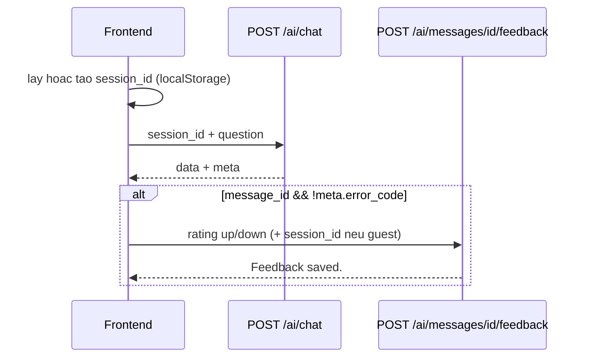

# AI Chatbot API — Contract cho Frontend

Tài liệu contract REST cho chatbot RAG Bookify. Mọi thay đổi response phải cập nhật file này và `tests/Feature/Ai/ChatApiContractTest.php`.

Pipeline chi tiết: [rag-chatbot-implementation-plan.md](./rag-chatbot-implementation-plan.md).

---

## Chung / Common

| | |
|---|---|
| **Base path** | `/api/v1` |
| **Auth** | Không bắt buộc. Member gửi kèm cookie Sanctum SPA (`credentials: include`). |
| **CORS** | `supports_credentials: true`; origin SPA trong `CORS_ALLOWED_ORIGINS`. |
| **Guest session** | Frontend sinh UUID v4, lưu `localStorage` (gợi ý key: `bookify_chat_session_id`), gửi lại mỗi request chat/feedback. |

### Rate limit

| Endpoint | Middleware | Guest | Member |
|----------|------------|-------|--------|
| Chat | `throttle:ai-chat` | IP + `session_id` | `account_id` |
| Feedback | `throttle:ai-chat-feedback` | IP + `session_id` | `account_id` |

Mặc định (`.env`): chat guest 20/phút, member 60/phút; feedback guest 30/phút, member 60/phút.

HTTP `429` — body ví dụ:

```json
{
  "message": "Ban dang gui qua nhieu tin nhan, vui long thu lai sau."
}
```

---

## 1. Chat — `POST /api/v1/ai/chat`

Gửi câu hỏi; nhận câu trả lời + metadata retrieval/evaluation.

**Middleware:** `web`, `throttle:ai-chat`

### Request

| Field | Type | Required | Ghi chú |
|-------|------|----------|---------|
| `session_id` | string (UUID v4) | Có | Guest & member |
| `question` | string | Có | Độ dài `AI_CHAT_MIN_QUESTION_LENGTH`–`AI_CHAT_MAX_QUESTION_LENGTH` (mặc định 2–1000) |

```json
{
  "session_id": "550e8400-e29b-41d4-a716-446655440000",
  "question": "Toi muon tim sach ve ky nang giao tiep"
}
```

**Member:** cùng body; backend ghi `account_id` từ session đăng nhập (không gửi trong body).

### Response envelope

Mọi response thành công HTTP `200` dùng:

```json
{
  "data": { },
  "meta": { }
}
```

### `data` — trường / fields

| Field | Type | Mô tả |
|-------|------|--------|
| `message_id` | `integer` \| `null` | ID log DB; xem mục [Khi nào `message_id` = null](#khi-nao-message_id--null) |
| `answer` | `string` | Nội dung hiển thị cho user |
| `sources` | `array` | Sách tham chiếu; rỗng nếu không match context |

#### `sources[]` item

| Field | Type |
|-------|------|
| `book_id` | `integer` |
| `name` | `string` |
| `slug` | `string` |
| `score` | `number` (float, ví dụ `0.82`) |

```json
{
  "book_id": 10,
  "name": "Dac Nhan Tam",
  "slug": "dac-nhan-tam",
  "score": 0.82
}
```

### `meta` — trường / fields

| Field | Type | Mô tả |
|-------|------|--------|
| `session_id` | `string` | Echo `session_id` request |
| `model` | `string` \| `null` | Model Gemini khi trả lời thật; `null` khi fallback |
| `retrieval` | `object` | Kết quả RAG |
| `evaluation` | `object` \| `null` | Đánh giá tự động; xem [Khi nào `evaluation` = null](#khi-nao-evaluation--null) |
| `error_code` | `string` | Chỉ có khi fallback/degrade (không có trên success thuần) |

#### `meta.retrieval`

| Field | Type | Giá trị |
|-------|------|---------|
| `strategy` | `string` | `hybrid`, `rrf`, `none` |
| `top_score` | `number` \| `null` | Điểm cao nhất |
| `matched` | `boolean` | Có inject context sách vào prompt hay không |

#### `meta.evaluation` (khi có)

| Field | Type |
|-------|------|
| `verdict` | `pass` \| `warning` \| `fail` |
| `groundedness_score` | `number` (0–1) |
| `relevance_score` | `number` (0–1) |
| `has_hallucination_risk` | `boolean` |

**Frontend:** không hiển thị `evaluation` cho user cuối (chỉ debug nội bộ nếu cần).

### Ví dụ — Guest/Member success

```json
{
  "data": {
    "message_id": 123,
    "answer": "Ban co the tham khao sach ve ky nang giao tiep...",
    "sources": [
      {
        "book_id": 10,
        "name": "Dac Nhan Tam",
        "slug": "dac-nhan-tam",
        "score": 0.82
      }
    ]
  },
  "meta": {
    "session_id": "550e8400-e29b-41d4-a716-446655440000",
    "model": "gemini-2.5-flash-lite",
    "retrieval": {
      "strategy": "hybrid",
      "top_score": 0.82,
      "matched": true
    },
    "evaluation": {
      "verdict": "pass",
      "groundedness_score": 0.8,
      "relevance_score": 0.85,
      "has_hallucination_risk": false
    }
  }
}
```

### Ví dụ — Không có sách match (`sources: []`)

```json
{
  "data": {
    "message_id": 124,
    "answer": "Minh chua tim thay thong tin phu hop trong du lieu hien co.",
    "sources": []
  },
  "meta": {
    "session_id": "550e8400-e29b-41d4-a716-446655440000",
    "model": "gemini-2.5-flash-lite",
    "retrieval": {
      "strategy": "hybrid",
      "top_score": 0.4,
      "matched": false
    },
    "evaluation": {
      "verdict": "pass",
      "groundedness_score": 0.8,
      "relevance_score": 0.85,
      "has_hallucination_risk": false
    }
  }
}
```

### Ví dụ — Fallback (Gemini / embedding lỗi)

```json
{
  "data": {
    "message_id": 125,
    "answer": "Chatbot dang ban, vui long thu lai sau.",
    "sources": []
  },
  "meta": {
    "session_id": "550e8400-e29b-41d4-a716-446655440000",
    "model": null,
    "retrieval": {
      "strategy": "none",
      "top_score": null,
      "matched": false
    },
    "evaluation": null,
    "error_code": "gemini_chat_failed"
  }
}
```

`error_code` khác: `embedding_failed`.

| `error_code` | Ý nghĩa |
|--------------|---------|
| `gemini_chat_failed` | Timeout / lỗi Gemini chat / thiếu API key |
| `embedding_failed` | Không embed được câu hỏi → không retrieval |

**Redis:** fallback **không** append vào lịch sử hội thoại (`chat:{session_id}`).

### Khi nào `message_id` = null

| Tình huống | `message_id` |
|------------|--------------|
| Gemini trả lời thật, log DB **thành công** | `integer` > 0 |
| Gemini fallback, log DB thành công | Thường vẫn có `integer` (để thống kê lỗi) |
| Gemini trả lời thật, log DB **thất bại** | `null` |

**Frontend — hiển thị feedback (thumbs):**

| Điều kiện | Gợi ý UI |
|-----------|----------|
| `data.message_id == null` | **Ẩn** nút thumbs |
| `meta.error_code` có giá trị | **Ẩn** thumbs (câu hệ thống, không đánh giá chất lượng RAG) — khuyến nghị product |
| Còn lại + có `message_id` | Hiện thumbs up/down |

API vẫn **có thể** nhận feedback trên message fallback nếu có `message_id`; FE nên ẩn theo bảng trên.

### Khi nào `evaluation` = null

- Fallback (`error_code` set)
- Không có câu trả lời thật từ Gemini
- Lưu evaluation DB thất bại
- Log message thất bại (kèm `message_id` null)

### Lỗi validation — HTTP 422

```json
{
  "message": "The session id field is required.",
  "errors": {
    "session_id": ["The session id field is required."]
  }
}
```

---

## 2. Feedback — `POST /api/v1/ai/messages/{message}/feedback`

`{message}` = `data.message_id` từ response chat.

**Middleware:** `web`, `throttle:ai-chat-feedback`

MVP: chỉ **thumbs up / down** (`up` / `down`). Không có `reason` hay `comment`.

### Request

| Field | Type | Required |
|-------|------|----------|
| `rating` | `up` \| `down` | Có |
| `session_id` | UUID v4 | **Guest:** bắt buộc. **Member** (message của mình): không bắt buộc. **Guest message + user đã login:** bắt buộc `session_id` khớp message |

**Guest:**

```json
{
  "session_id": "550e8400-e29b-41d4-a716-446655440000",
  "rating": "up"
}
```

**Member (message thuộc tài khoản):**

```json
{
  "rating": "down"
}
```

### Authorization (backend)

| Message | Ai được gửi feedback |
|---------|----------------------|
| Guest (`account_id` null trên message) | `session_id` request = `message.session_id` |
| Member (`account_id` set) | `auth()->id() == message.account_id` |

- Một `message_id` → **một** feedback; gửi lại **cập nhật** `rating`.
- Guest chat trước, login sau: vẫn feedback được message cũ nếu gửi đúng `session_id` cũ.

### Response success — HTTP 200

```json
{
  "message": "Feedback saved."
}
```

### Lỗi

| HTTP | Khi nào |
|------|---------|
| `404` | `message` không tồn tại |
| `403` | Không đủ quyền (session/account không khớp) |
| `422` | Validation (`rating`, thiếu `session_id` guest) |
| `429` | Rate limit |

---

## 3. Luồng tích hợp FE / Integration flow



### Checklist frontend

1. Khởi tạo `bookify_chat_session_id` (UUID v4) nếu chưa có.
2. `POST /api/v1/ai/chat` với `credentials: 'include'`.
3. Hiển thị `data.answer`; link sách từ `data.sources` (slug).
4. Loading / lỗi: dùng `meta.error_code` hoặc `data.answer` fallback.
5. Thumbs chỉ khi `message_id` và không có `error_code` (khuyến nghị).
6. Feedback: `POST /api/v1/ai/messages/{message_id}/feedback`.

---

## 4. Kiểm thử contract / Contract tests

```bash
cd backend
php artisan test tests/Feature/Ai/ChatTest.php \
  tests/Feature/Ai/ChatRagTest.php \
  tests/Feature/Ai/ChatFeedbackTest.php \
  tests/Feature/Ai/ChatApiContractTest.php
```

File bảo vệ envelope: `tests/Feature/Ai/ChatApiContractTest.php`.

---

## 5. Cấu hình liên quan / Related config

| Key | Mặc định | Ý nghĩa |
|-----|----------|---------|
| `GEMINI_API_KEY` | — | Bắt buộc cho chat thật |
| `GEMINI_CHAT_MODEL` | `gemini-2.5-flash-lite` | `meta.model` |
| `AI_CHAT_FALLBACK_MESSAGE` | Chatbot đang bận... | Fallback answer |
| `AI_CHAT_MIN_QUESTION_LENGTH` | `2` | |
| `AI_CHAT_MAX_QUESTION_LENGTH` | `1000` | |
| `AI_CHAT_RATE_LIMIT_GUEST` | `20` | |
| `AI_CHAT_RATE_LIMIT_MEMBER` | `60` | |
| `AI_CHAT_FEEDBACK_RATE_LIMIT_GUEST` | `30` | |
| `AI_CHAT_FEEDBACK_RATE_LIMIT_MEMBER` | `60` | |

Sau đổi `.env`: `php artisan config:clear`.
