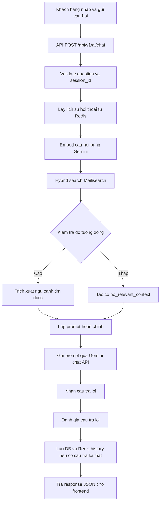

# Ke hoach trien khai RAG Chatbot

## 1. Muc tieu

Xay dung chatbot RAG muc co ban cho Bookify, co kha nang tra loi cau hoi cua khach hang dua tren du lieu sach trong he thong va co lop danh gia chat luong cau tra loi.

He thong can:

- Tra loi ve sach, tac gia, the loai, mo ta, gia, danh gia va tinh trang con hang.
- Goi y sach phu hop voi nhu cau nguoi dung dua tren ngu canh duoc truy xuat.
- Chi tra loi dua tren du lieu Bookify cung cap, khong bia thong tin.
- Luu lich su hoi thoai ngan han trong Redis voi TTL 24 gio.
- Ghi log chat va ket qua danh gia de phan tich chat luong ve sau.
- Cho phep nguoi dung danh gia cau tra loi bang feedback don gian.

## 2. Pham vi MVP

### 2.1. Lam trong MVP

- API chat: `POST /api/v1/ai/chat`.
- Lich su hoi thoai luu Redis theo `session_id`.
- Guest dung `session_id` do frontend sinh va gui len.
- Embedding cau hoi bang `gemini-embedding-2` (768 chieu qua `output_dimensionality`).
- Hybrid search tren Meilisearch: ket hop keyword search va vector search (`semanticRatio` 0.5–0.7).
- Prompt builder voi sliding window history.
- Goi `gemini-2.5-flash-lite` de sinh cau tra loi (co the nang cap `gemini-2.5-flash` sau).
- Fallback khi khong tim thay ngu canh phu hop.
- Fallback than thien khi Gemini/Meilisearch loi.
- Danh gia tu dong co ban sau khi co cau tra loi.
- API feedback cua nguoi dung.
- Luu chat message, retrieval metadata, model version, evaluation va feedback vao database.
- Test cho cac luong chinh.

### 2.2. Chua lam trong MVP

- Tra cuu don hang ca nhan, hoan tien, dia chi giao hang hoac thong tin rieng tu khac.
- LLM-as-judge nang cao cho hallucination detection.
- Query expansion.
- Fine-tuning model.
- Streaming response.
- Admin dashboard phan tich chatbot.

## 3. Luong nghiep vu muc tieu



## 4. Quyet dinh ky thuat da chot

| Noi dung | Quyet dinh |
| --- | --- |
| Backend | Laravel API trong `backend/` |
| Auth | Sanctum cookie-based, API chat cho phep guest va member |
| LLM | Google Gemini Chat API — `gemini-2.5-flash-lite` (MVP); nang cap `gemini-2.5-flash` neu chat quality khong dat |
| Embedding | Gemini `gemini-embedding-2` |
| Embedding dimension | 768 (`output_dimensionality` qua Matryoshka; mac dinh model la 3072) |
| Vector store | Meilisearch |
| Vector mode | User-provided vectors |
| Search mode | Hybrid search: keyword + vector, `semanticRatio` 0.5–0.7 |
| Redis | Luu history voi TTL 24h |
| Database | MySQL luu message, evaluation, feedback |
| Frontend session | Guest sinh UUID v4 va luu `localStorage` |
| Backend session | Backend validate format, khong tu sinh session cho guest |
| Rate limit | Tach guest/member |
| History in prompt | Sliding window, mac dinh 10 luot gan nhat |
| Fallback Gemini loi | Tra fallback cho user, log DB voi `error_code`, khong luu fallback vao Redis history |
| Metadata dong trong prompt | Sau retrieval, fetch lai DB cho top K de lay gia/rating/ton kho hien tai |
| Evaluation MVP | Chay sync trong request vi rule-based nhanh; chi queue khi nang cap LLM-as-judge |

## 5. API contract du kien

### 5.1. Chat

Endpoint:

```text
POST /api/v1/ai/chat
```

Middleware:

```text
web, throttle:ai-chat
```

Request:

```json
{
  "session_id": "uuid-v4-string",
  "question": "Toi muon tim sach ve ky nang giao tiep"
}
```

Quy tac:

- `session_id` bat buoc cho guest va member.
- Frontend guest sinh UUID v4, luu `localStorage`, gui lai trong moi request chat.
- Backend chi validate `session_id`, khong dung session_id de xac thuc nguoi dung.
- Neu user da dang nhap, `account_id` lay tu `auth()->id()` de log va phan tich.
- `question` gioi han do dai, vi du 2 den 1000 ky tu.

Response thanh cong:

```json
{
  "data": {
    "message_id": 123,
    "answer": "Ban co the tham khao...",
    "sources": [
      {
        "book_id": 10,
        "name": "Ten sach",
        "slug": "ten-sach",
        "score": 0.82
      }
    ]
  },
  "meta": {
    "session_id": "uuid-v4-string",
    "model": "gemini-2.5-flash-lite",
    "retrieval": {
      "strategy": "hybrid",
      "top_score": 0.82,
      "matched": true
    },
    "evaluation": {
      "verdict": "pass",
      "groundedness_score": 0.8,
      "relevance_score": 0.8,
      "has_hallucination_risk": false
    }
  }
}
```

Response fallback khi Gemini loi hoac DB log loi:

```json
{
  "data": {
    "message_id": null,
    "answer": "Chatbot dang ban, vui long thu lai sau.",
    "sources": []
  },
  "meta": {
    "session_id": "uuid-v4-string",
    "model": null,
    "retrieval": {
      "strategy": "none",
      "top_score": null,
      "matched": false
    },
    "evaluation": null,
    "error_code": "gemini_chat_failed"
  }
}
```

Quy tac response:

- `message_id` nullable. Frontend chi hien feedback controls khi `message_id` khac null.
- `meta.evaluation` nullable neu khong co cau tra loi that tu Gemini hoac ghi DB/evaluation that bai.
- Fallback do Gemini chat loi khong duoc xem la cau tra loi that va khong ghi vao Redis history.

### 5.2. Feedback

Endpoint:

```text
POST /api/v1/ai/chat/messages/{message}/feedback
```

Request:

```json
{
  "rating": "helpful",
  "reason": "answer_correct",
  "comment": "Tra loi dung nhu minh can"
}
```

Gia tri `rating`:

- `helpful`
- `not_helpful`

Gia tri `reason` goi y:

- `answer_correct`
- `answer_incorrect`
- `missing_information`
- `hard_to_understand`
- `irrelevant`
- `other`

## 6. Cau hinh moi

Tao `config/ai.php`.

```php
<?php

return [
    'gemini' => [
        'api_key' => env('GEMINI_API_KEY'),
        'chat_model' => env('GEMINI_CHAT_MODEL', 'gemini-2.5-flash-lite'),
        'embedding_model' => env('GEMINI_EMBEDDING_MODEL', 'gemini-embedding-2'),
        'timeout_seconds' => (int) env('AI_CHAT_TIMEOUT_SECONDS', 15),
        'retry_times' => (int) env('AI_CHAT_RETRY_TIMES', 2),
        'retry_sleep_ms' => (int) env('AI_CHAT_RETRY_SLEEP_MS', 200),
    ],

    'rag' => [
        'index_name' => env('AI_RAG_INDEX_NAME', 'books'),
        'embedder_name' => env('AI_RAG_EMBEDDER_NAME', 'gemini_embedding_2_768'),
        'embedding_dimensions' => (int) env('AI_RAG_EMBEDDING_DIMENSIONS', 768),
        'top_k' => (int) env('AI_RAG_TOP_K', 5),
        'min_score' => (float) env('AI_RAG_MIN_SCORE', 0.65),
        'rrf_min_score' => (float) env('AI_RAG_RRF_MIN_SCORE', 0.02),
        'hybrid_semantic_ratio' => (float) env('AI_RAG_HYBRID_SEMANTIC_RATIO', 0.6),
        'sync_batch_size' => (int) env('AI_RAG_SYNC_BATCH_SIZE', 20),
        'sync_batch_sleep_ms' => (int) env('AI_RAG_SYNC_BATCH_SLEEP_MS', 500),
    ],

    'chat' => [
        'history_ttl_seconds' => (int) env('AI_CHAT_HISTORY_TTL_SECONDS', 86400),
        'history_max_turns' => (int) env('AI_CHAT_HISTORY_MAX_TURNS', 10),
        'max_question_length' => (int) env('AI_CHAT_MAX_QUESTION_LENGTH', 1000),
        'fallback_message' => env('AI_CHAT_FALLBACK_MESSAGE', 'Chatbot dang ban, vui long thu lai sau.'),
        'no_context_message' => env('AI_CHAT_NO_CONTEXT_MESSAGE', 'Minh chua tim thay thong tin phu hop trong du lieu Bookify.'),
    ],

    'rate_limits' => [
        'guest_per_minute' => (int) env('AI_CHAT_RATE_LIMIT_GUEST', 20),
        'member_per_minute' => (int) env('AI_CHAT_RATE_LIMIT_MEMBER', 60),
    ],
];
```

Bien moi trong `.env`:

```env
GEMINI_API_KEY=
GEMINI_CHAT_MODEL=gemini-2.5-flash-lite
GEMINI_EMBEDDING_MODEL=gemini-embedding-2
AI_CHAT_TIMEOUT_SECONDS=15
AI_CHAT_RETRY_TIMES=2
AI_CHAT_RETRY_SLEEP_MS=200
AI_RAG_INDEX_NAME=books
AI_RAG_EMBEDDER_NAME=gemini_embedding_2_768
AI_RAG_EMBEDDING_DIMENSIONS=768
AI_RAG_TOP_K=5
AI_RAG_MIN_SCORE=0.65
AI_RAG_RRF_MIN_SCORE=0.02
AI_RAG_HYBRID_SEMANTIC_RATIO=0.6
AI_RAG_SYNC_BATCH_SIZE=20
AI_RAG_SYNC_BATCH_SLEEP_MS=500
AI_CHAT_HISTORY_TTL_SECONDS=86400
AI_CHAT_HISTORY_MAX_TURNS=10
AI_CHAT_MAX_QUESTION_LENGTH=1000
AI_CHAT_RATE_LIMIT_GUEST=20
AI_CHAT_RATE_LIMIT_MEMBER=60
```

Sau khi thay doi `.env` tren moi moi truong:

```bash
php artisan config:clear
```

Ghi chu model:

- `gemini-1.5-flash` va `text-embedding-004` da shutdown (09/2025 va 01/2026); khong dung lai.
- LLM MVP: `gemini-2.5-flash-lite` — khong co thinking mac dinh, latency/chi phi thap hon `gemini-2.5-flash`. Neu chat quality khong dat sau manual test, doi `GEMINI_CHAT_MODEL=gemini-2.5-flash` (co the can `thinkingBudget=0` de giam latency).
- Embedding: `gemini-embedding-2` mac dinh 3072 chieu; bat buoc truyen `output_dimensionality` = `AI_RAG_EMBEDDING_DIMENSIONS` (768) trong moi request `embedContent`. Vector truncated duoc model tu normalize.
- Doi embedding model hoac dimension bat buoc re-index toan bo Meilisearch va doi `AI_RAG_EMBEDDER_NAME` tuong ung.

## 7. Du lieu embedding cua sach

### 7.1. Nguyen tac

Text dua vao embedding phai on dinh va the hien noi dung ngu nghia cua sach. Khong dua metadata thay doi thuong xuyen vao embedding text.

Khong dua vao embedding text:

- Gia ban.
- Ton kho.
- Rating trung binh.
- Review count.
- Flash sale/promotion.

Cac truong dong nay chi dua vao retrieved context luc build prompt.

### 7.2. Template embedding text

Tao service/factory rieng, vi du:

```text
Ten sach: {book.name}
Tac gia: {author_names}
The loai: {category_names}
Mo ta: {description}
Nha xuat ban: {publisher_name}
Ngon ngu: {language}
Hinh thuc: {format}
Nam xuat ban: {publication_year}
```

Neu field khong co du lieu thi bo qua dong do. Can normalize whitespace va cat description qua dai neu can.

### 7.3. Context dua vao prompt

Context trong prompt co the giau hon embedding text:

```text
[Book #10]
Ten sach: ...
Slug: ...
Tac gia: ...
The loai: ...
Mo ta ngan: ...
Nha xuat ban: ...
Gia ban: ...
Rating: ...
So danh gia: ...
Con hang: co/khong
Similarity score: ...
```

Quy tac:

- Neu `in_stock = false`, van co the dung de tra loi thong tin sach, nhung khi goi y mua phai noi sach hien het hang.
- Gia, rating, ton kho bat buoc fetch lai tu MySQL cho top K `book_id` sau retrieval, truoc khi build prompt. Khong dung truc tiep metadata dong trong Meilisearch document de tra loi gia/ton kho.

## 8. Meilisearch vector va hybrid search

### 8.1. Embedder configuration

Vi embedding duoc tinh ben ngoai bang Gemini, Meilisearch can user-provided embedder.

Ten embedder mac dinh:

```text
gemini_embedding_2_768
```

Cau hinh index can khai bao embedder user-provided voi dimension 768 (khop `output_dimensionality` cua `gemini-embedding-2`). Viec nay nen lam bang command rieng:

```text
php artisan ai:meilisearch-configure
```

Command thuc hien:

- Lay index tu `config('ai.rag.index_name')`.
- Goi Meilisearch API cap nhat embedders.
- Khai bao embedder `userProvided`.
- Khai bao dimension `768`.
- Dam bao searchable/filterable/sortable attributes hien co cua `books` khong bi mat.
- Dam bao `rag_embedding_text` khong nam trong `searchableAttributes`; truong nay chi dung debug/vector rebuild, khong dung keyword search.

Ghi chu van hanh:

- Neu doi embedding model hoac dimension, bat buoc re-index toan bo vector documents.
- Khong tron vector cua nhieu model trong cung mot embedder.

### 8.2. Payload document

Khi sync document vao Meilisearch, payload can co `_vectors`.

Vi du:

```json
{
  "id": 10,
  "name": "Ten sach",
  "slug": "ten-sach",
  "description": "...",
  "author_names": ["Tac gia A"],
  "category_ids": [1, 2],
  "category_names": ["Ky nang"],
  "publisher_name": "NXB ...",
  "selling_price": 120000,
  "average_rating": 4.5,
  "review_count": 20,
  "available_stock": 12,
  "in_stock": true,
  "is_active": true,
  "rag_embedding_text": "Ten sach: ...",
  "_vectors": {
    "gemini_embedding_2_768": [0.01, 0.02]
  }
}
```

### 8.3. Hybrid search

Retrieval nen dung hybrid search thay vi pure vector.

Muc tieu:

- Cau hoi ngu nghia: "sach ve ky nang giao tiep" duoc vector search xu ly tot.
- Cau hoi exact match: "Dac Nhan Tam" van duoc keyword search xu ly tot.

Tham so de cau hinh:

- `top_k`: mac dinh 5.
- `min_score`: mac dinh 0.65.
- `hybrid_semantic_ratio`: mac dinh 0.6; khoang khuyen nghi 0.5–0.7 (Meilisearch ecommerce). Tang neu cau hoi ngu nghia nhieu, giam neu exact match ten sach/tac gia quan trong hon.

Neu Meilisearch local chua ho tro hybrid dung API version hien tai, fallback co kiem soat:

1. Chay keyword search voi query goc.
2. Chay vector search voi embedding.
3. Merge ket qua bang Reciprocal Rank Fusion, khong cong truc tiep raw score vi score keyword va vector khac scale.

Cong thuc fallback RRF:

```text
rrf_score(book) = sum(1 / (rank + 60))
```

Quy tac fallback RRF:

- Rank bat dau tu 1 trong tung danh sach keyword/vector.
- Ket qua co trong ca hai danh sach se duoc cong diem hai lan.
- Khi dung RRF fallback, `min_score = 0.65` khong ap dung. Dung threshold rieng `AI_RAG_RRF_MIN_SCORE`, mac dinh `0.02`.
- Truoc khi code fallback, can test Meilisearch version local/production co ho tro hybrid `semanticRatio` hay khong de quyet dinh co can RRF path.

### 8.4. Dong bo khi du lieu sach thay doi

Vector document phai duoc cap nhat khi embedding text thay doi.

Trigger MVP:

- `BookObserver`: enqueue sync request cho book khi `name`, `is_active` hoac cac truong search quan trong thay doi.
- `BookDetailObserver`: enqueue sync request khi `description`, `language`, `format`, `publication_year` thay doi.
- `AuthorObserver`/quan he `book_authors`: enqueue cac `book_id` bi anh huong khi ten tac gia hoac gan tac gia thay doi.
- `CategoryObserver`/quan he `book_categories`: enqueue cac `book_id` bi anh huong khi ten danh muc hoac gan danh muc thay doi.
- `PublisherObserver`: enqueue cac `book_id` bi anh huong khi ten nha xuat ban thay doi.

Khong dispatch mot job Gemini rieng cho tung sach ngay trong observer khi co thay doi quan he lon. Observer chi ghi/debounce sync request, sau do worker/command xu ly theo batch.

Co che batch/debounce de tranh fanout:

- Redis set/list tam: `ai:rag:sync:pending_book_ids`.
- Observer add `book_id` vao pending set sau commit; trung lap tu nhieu observer chi giu mot lan.
- Job/command batch lay toi da `AI_RAG_SYNC_BATCH_SIZE`, mac dinh 20 book/lua.
- Giua cac batch sleep `AI_RAG_SYNC_BATCH_SLEEP_MS`, mac dinh 500ms, de giam nguy co bi Gemini throttle.
- Queue cho sync nen tach rieng, vi du `ai-rag-sync`, de khong canh tranh voi checkout/payment/order jobs.
- Neu mot NXB co 500 sach, he thong tao pending set 500 id nhung worker xu ly theo 25 batch nho thay vi dispatch 500 request Gemini cung luc.

Thanh phan goi y:

- `QueueBookRagSyncService`: nhan danh sach `book_id`, ghi pending set va debounce.
- `SyncPendingBookRagDocuments`: job/command doc pending set theo batch, goi embedding va update Meilisearch.
- `SyncBookRagDocument`: chi dung cho sync mot sach thu cong hoac trong batch worker, khong dispatch hang loat truc tiep tu observer.

Schedule bo tro:

- Chay full/partial sync dinh ky hang dem neu can, de sua cac event bi miss.
- Metadata dong nhu gia, rating, ton kho co the sync vao Meilisearch de phuc vu filter/debug, nhung prompt van fetch lai MySQL cho top K.

## 9. Thiet ke database bo sung

### 9.1. Bang `ai_chat_messages`

Muc dich: log moi luot hoi-dap va metadata phuc vu debug/chat quality.

| Cot | Kieu goi y | Ghi chu |
| --- | --- | --- |
| `id` | `bigint unsigned` | Primary key |
| `session_id` | `char(36)` | UUID v4 tu frontend |
| `account_id` | `bigint unsigned nullable` | Member neu da dang nhap |
| `question` | `text` | Cau hoi cua nguoi dung |
| `answer` | `text` | Cau tra loi tra ve |
| `model_version` | `varchar(100)` | Vi du `gemini-2.5-flash-lite` |
| `retrieval_strategy` | `varchar(30)` | `hybrid`, `vector`, `keyword`, `none` |
| `retrieval_top_score` | `decimal(6,4) nullable` | Score cao nhat |
| `retrieval_matched` | `boolean` | Co dat threshold hay khong |
| `retrieved_books` | `json nullable` | Chi luu book_id, score, chunk key; khong luu full context dai |
| `token_usage` | `json nullable` | Neu Gemini tra ve |
| `latency_ms` | `integer unsigned nullable` | Tong latency |
| `error_code` | `varchar(50) nullable` | Neu degrade/fallback |
| `created_at`, `updated_at` | `timestamp nullable` | Theo Laravel |

Index:

- `session_id, created_at`
- `account_id, created_at`
- `retrieval_matched, created_at`

### 9.2. Bang `ai_chat_evaluations`

Muc dich: luu ket qua danh gia tu dong.

| Cot | Kieu goi y | Ghi chu |
| --- | --- | --- |
| `id` | `bigint unsigned` | Primary key |
| `message_id` | `bigint unsigned` | FK `ai_chat_messages.id` |
| `groundedness_score` | `decimal(4,3)` | 0 den 1 |
| `relevance_score` | `decimal(4,3)` | 0 den 1 |
| `has_hallucination_risk` | `boolean` | Regex/entity rule |
| `verdict` | `varchar(20)` | `pass`, `warning`, `fail` |
| `risk_flags` | `json nullable` | Danh sach flag |
| `evaluated_at` | `timestamp` | Thoi diem danh gia |

Constraint:

- FK cascade delete theo message.
- Co the unique `message_id` neu moi message chi co mot evaluation.

### 9.3. Bang `ai_chat_feedback`

Muc dich: luu danh gia cua nguoi dung.

| Cot | Kieu goi y | Ghi chu |
| --- | --- | --- |
| `id` | `bigint unsigned` | Primary key |
| `message_id` | `bigint unsigned` | FK `ai_chat_messages.id` |
| `account_id` | `bigint unsigned nullable` | Neu da dang nhap |
| `session_id` | `char(36)` | De guest feedback |
| `rating` | `varchar(20)` | `helpful`, `not_helpful` |
| `reason` | `varchar(50) nullable` | Ly do chon san |
| `comment` | `text nullable` | Ghi chu tu nguoi dung |
| `created_at`, `updated_at` | `timestamp nullable` | Theo Laravel |

Index:

- `message_id`
- `account_id, created_at`
- `session_id, created_at`

Quy tac:

- Guest: moi `message_id + session_id` chi nen co mot feedback moi nhat, hoac cho phep update feedback cu.
- Member: moi `message_id + account_id` chi nen co mot feedback moi nhat, hoac cho phep update feedback cu.
- Feedback hop le neu `session_id` request khop `ai_chat_messages.session_id`, hoac user dang nhap co `account_id` khop `ai_chat_messages.account_id`.
- Khong yeu cau dong thoi ca `session_id` va `account_id` cung khop.
- Guest chat roi dang nhap sau do van duoc feedback message cu neu gui dung `session_id` cu.
- Member chat tren thiet bi A va feedback tren thiet bi B van hop le neu `account_id` khop, du `session_id` khac.

## 10. Service va thanh phan du kien

| Thanh phan | Vai tro |
| --- | --- |
| `App\Http\Controllers\Api\V1\Ai\ChatController` | Nhan request, goi service, tra resource |
| `App\Http\Controllers\Api\V1\Ai\ChatFeedbackController` | Nhan feedback |
| `App\Http\Requests\Ai\ChatRequest` | Validate `session_id`, `question` |
| `App\Http\Requests\Ai\ChatFeedbackRequest` | Validate feedback |
| `App\Http\Resources\Ai\ChatMessageResource` | Response chat |
| `App\Services\Ai\ChatbotService` | Orchestrate toan bo pipeline |
| `App\Services\Ai\PromptBuilder` | Build system prompt, history, context |
| `App\Services\Ai\GeminiClient` | Goi chat va embedding API |
| `App\Services\Ai\BookRagRetriever` | Hybrid retrieval tu Meilisearch |
| `App\Services\Ai\BookRagDocumentFactory` | Tao text embedding va payload context |
| `App\Services\Ai\ChatHistoryStore` | Doc/ghi Redis history |
| `App\Services\Ai\ChatEvaluationService` | Danh gia groundedness/relevance/risk |
| `App\Services\Ai\ChatFeedbackService` | Luu/update feedback |
| `App\Services\Ai\QueueBookRagSyncService` | Debounce va gom `book_id` can sync vao Redis pending set |
| `App\Console\Commands\Ai\ConfigureMeilisearchVectorIndexCommand` | Cau hinh embedder |
| `App\Console\Commands\Ai\SyncBookRagDocumentsCommand` | Rebuild/sync vector documents |
| `App\Jobs\Ai\SyncPendingBookRagDocuments` | Xu ly pending sync theo batch va sleep giua batch |
| `App\Jobs\Ai\SyncBookRagDocument` | Sync vector cho mot sach neu can queue |

## 11. Rate limiting

Can them limiter rieng trong `AppServiceProvider` hoac provider phu hop:

- Guest: theo IP + `session_id`, mac dinh 20 request/phut.
- Member: theo `account_id`, mac dinh 60 request/phut.

Route dung:

```text
throttle:ai-chat
```

Ly do:

- Moi request co the goi Gemini embedding va chat, anh huong chi phi.
- Guest khong co account_id nen khong the chi limit theo user.

Neu vuot gioi han:

- Tra HTTP `429`.
- Message JSON ngan gon: "Ban dang gui qua nhieu tin nhan, vui long thu lai sau."

## 12. Error handling va degrade

### 12.1. Gemini embedding loi

Embedding loi thi fail fast vi khong co vector de retrieval.

Ung xu:

- Log warning/error voi latency va message.
- Tra fallback message than thien.
- Luu `ai_chat_messages.error_code = embedding_failed` neu co tao message log.
- Khong append question/fallback vao Redis history.

### 12.2. Meilisearch loi

Meilisearch loi thi degrade co kiem soat.

Ung xu MVP:

- Log warning.
- Build prompt voi context rong va chi thi "khong co ngu canh truy xuat".
- Van co the goi Gemini de tra loi fallback theo system prompt.
- `retrieval_strategy = none`, `retrieval_matched = false`.

### 12.3. Gemini chat loi

Gemini timeout/rate limit/5xx:

- Bat exception trong `GeminiClient`.
- Log warning voi status code/latency.
- Tra message chuan trong config: `AI_CHAT_FALLBACK_MESSAGE`.
- Khong de loi 500 bubble len frontend.
- Co the luu DB log voi `error_code = gemini_chat_failed`, `answer` la fallback message de thong ke loi.
- Khong luu fallback message vao Redis history, de tranh lam nhieu context cua cac luot sau.

### 12.4. Database log loi

Neu ghi log DB loi:

- Khong lam request chat fail neu da co cau tra loi.
- Log error voi context toi thieu.
- Response co the khong co `message_id`, frontend khi do an feedback buttons hoac disable feedback.
- Neu Redis ghi history thanh cong nhung DB log loi, response van tra cau tra loi that voi `message_id = null`.

## 13. Prompt design

### 13.1. System instruction

System prompt can co cac quy tac:

- Ban la tro ly ao cua Bookify, chi ho tro ve sach va mua sach tren Bookify.
- Chi dung thong tin trong `retrieved_context` va `conversation_history`.
- Khong bia gia, ton kho, nam xuat ban, so trang, ISBN, tac gia.
- Neu khong co thong tin phu hop, noi ro chua tim thay trong du lieu Bookify.
- Khi goi y sach, neu co the hay neu ten sach, tac gia, gia, rating va ly do ngan.
- Neu sach het hang, khong khuyen khich "mua ngay"; chi noi hien sach het hang.
- Tra loi bang tieng Viet, ngan gon, de hieu.

### 13.2. Sliding window history

`PromptBuilder` chi dua toi da `AI_CHAT_HISTORY_MAX_TURNS` luot gan nhat vao prompt.

Mot "turn" gom:

- user question
- assistant answer

Mac dinh:

```text
AI_CHAT_HISTORY_MAX_TURNS=10
```

Redis co the luu nhieu hon trong TTL, nhung prompt chi lay window gan nhat.

### 13.3. Redis history structure

Redis key:

```text
chat:{session_id}
```

Value luu dang JSON array:

```json
[
  {
    "role": "user",
    "content": "Toi muon tim sach ve ky nang giao tiep",
    "created_at": "2026-05-29T10:00:00+07:00"
  },
  {
    "role": "assistant",
    "content": "Ban co the tham khao...",
    "created_at": "2026-05-29T10:00:03+07:00"
  }
]
```

Quy tac:

- Chi append vao Redis khi Gemini chat tra ve cau tra loi that.
- Khong append fallback do embedding/chat API loi.
- Co the append cau "khong tim thay thong tin phu hop" neu day la cau tra loi that tu Gemini duoc sinh theo prompt low-context.

## 14. Danh gia ket qua MVP

### 14.1. Metric tu dong

`ChatEvaluationService` tinh cac truong:

- `groundedness_score`
- `relevance_score`
- `has_hallucination_risk`
- `verdict`
- `risk_flags`

Evaluation MVP chay sync trong request. Ly do: implementation chi la string matching va regex scan, muc tieu duoi 10ms. Khi nang cap sang LLM-as-judge hoac evaluator ton token, phai chuyen sang queue va response se tra `meta.evaluation.status = pending`.

### 14.2. Groundedness MVP

Dung rule-based matching:

1. Trich entity quan trong tu answer:
   - ten sach trong retrieved books
   - tac gia
   - gia tien
   - nam xuat ban
   - so trang neu co
2. Neu answer nhac ten sach/tac gia/gia co trong context, cong diem.
3. Neu answer nhac thong tin cu the khong co trong context, tru diem va them risk flag.

Nguon context de doi chieu khong chi la text prompt thuan. `ChatEvaluationService` phai nhan structured facts da fetch tu MySQL cho top K:

- `book_id`
- `name`
- `author_names`
- `selling_price`
- `average_rating`
- `review_count`
- `available_stock`
- `publication_year`
- `num_pages`

Quy tac: so lieu trong answer chi bi coi la risk neu khong khop voi bat ky structured fact nao cua retrieved books. Vi du answer noi `150.000 dong` va `selling_price` cua mot retrieved book la `150000.00` thi khong flag hallucination risk, du text context khong chua dung chuoi `150.000`.

Chap nhan string matching don gian o MVP:

- Normalize lowercase.
- Khong bo dau tieng Viet mac dinh. Neu bat accent-insensitive matching sau nay, phai co test vi cac cap tu khac dau co the trung nhau sau normalize.
- Gom whitespace.
- So sanh contains.

### 14.3. Hallucination risk MVP

Flag `has_hallucination_risk = true` neu answer chua claim cu the ma structured facts khong co. Regex chi dung de tim candidate claim, khong duoc tu no quyet dinh hallucination.

- Gia tien: `120.000`, `120000`, `120k`, `VNĐ`, `dong`.
- Nam: so 4 chu so trong khoang hop ly.
- So trang: `trang`, `pages`.
- ISBN.
- Ty le phan tram.

Quy trinh de giam false positive:

1. Regex tim candidate claim trong answer.
2. Chuan hoa candidate claim ve dang so/co cau truc, vi du `150.000 dong` -> `150000`.
3. Doi chieu voi structured facts cua retrieved books da fetch tu MySQL.
4. Chi them risk flag neu candidate claim khong khop facts nao.
5. Khong flag chi vi text prompt khong chua cung mot dinh dang chuoi.

Day la canh bao, khong chan response.

### 14.4. Relevance MVP

Tinh don gian:

- Neu retrieval matched va answer khong rong: diem mac dinh 0.7.
- Neu answer co it nhat mot entity tu retrieved context: tang diem.
- Neu retrieval khong matched va answer noi khong tim thay: diem cao.
- Neu retrieval khong matched nhung answer van goi y sach cu the: diem thap va `verdict = warning` hoac `fail`.

### 14.5. Verdict

Quy tac de xuat:

| Dieu kien | Verdict |
| --- | --- |
| `has_hallucination_risk = false` va groundedness >= 0.7 | `pass` |
| Co risk nhe hoac groundedness 0.4-0.69 | `warning` |
| Retrieval thap nhung answer bia thong tin cu the | `fail` |

## 15. Trinh tu trien khai theo lat nho

### Lat 1: Nen tang config, route skeleton va session contract

Muc tieu: tao khung chatbot chua goi Gemini that, dam bao API contract va session flow ro rang.

Pham vi:

- Tao `config/ai.php`.
- Them `.env.example` neu du an co file nay.
- Tao `ChatRequest` validate `session_id` UUID va `question`.
- Tao route `POST /api/v1/ai/chat`.
- Tao `ChatController` va response stub co cau truc JSON dung contract.
- Them rate limiter `ai-chat`.
- Document frontend: guest sinh UUID v4 luu `localStorage`.
- Test request validation va rate limit.

Ket qua demo:

- Goi API voi `session_id` hop le nhan response JSON stub.
- Goi thieu `session_id` hoac question qua dai nhan 422.

Chua lam:

- Chua goi Gemini.
- Chua goi Meilisearch.
- Chua luu DB.

### Lat 2: Database log va Redis history

Muc tieu: moi request chat co the luu history va log message.

Pham vi:

- Tao migration/model `AiChatMessage`.
- Tao `ChatHistoryStore`.
- Redis key: `chat:{session_id}`.
- Redis value la JSON array gom object `{role, content, created_at}`.
- TTL sliding: refresh TTL sau moi interaction.
- Prompt history chi dung toi da `AI_CHAT_HISTORY_MAX_TURNS`.
- Log message voi `model_version`, `latency_ms`, `retrieval_strategy = none`.
- Test Redis history append, TTL refresh va DB log.

Ket qua demo:

- Chat stub nhieu lan cung `session_id` thi Redis co history lien tuc.
- Reload frontend van giu context neu gui lai cung `session_id`.

### Lat 3: GeminiClient va fallback loi

Muc tieu: co client goi Gemini chat/embedding voi timeout, retry va fallback.

Pham vi:

- Tao `GeminiClient`.
- Method `embedText(string $text): array` — goi `embedContent` voi `output_dimensionality` tu `config('ai.rag.embedding_dimensions')`.
- Method `generateAnswer(array $payload): GeminiChatResult`.
- Timeout va retry theo config.
- Bat timeout, rate-limit, 5xx.
- Log token usage va latency neu co.
- Test bang fake HTTP response.

Ket qua demo:

- Service co the goi fake Gemini va parse cau tra loi.
- Khi fake timeout, API tra fallback message, khong 500.

### Lat 4: RAG document text va Meilisearch vector config

Muc tieu: dinh nghia cach tao vector document cho sach va cau hinh Meilisearch embedder.

Pham vi:

- Tao `BookRagDocumentFactory`.
- Tao embedding text theo template o muc 7.
- Bo gia/rating/ton kho khoi embedding text.
- Them metadata dong vao document payload de dung trong prompt.
- Tao command `ai:meilisearch-configure`.
- Command cau hinh user-provided embedder dimension 768.
- Test factory tao text dung, khong include price/rating/stock trong embedding text.

Ket qua demo:

- Mot sach co document payload day du.
- Meilisearch index da co embedder cau hinh dung.

### Lat 5: Sync vector documents

Muc tieu: dua vector cua sach vao Meilisearch.

Pham vi:

- Tao command `ai:sync-book-rag-documents`.
- Tao job `SyncBookRagDocument` de sync mot sach.
- Tao `QueueBookRagSyncService` va `SyncPendingBookRagDocuments` de gom pending `book_id` theo batch.
- Lay sach active va relation can thiet: detail, authors, categories, publisher, inventories.
- Goi Gemini embedding cho embedding text (model `gemini-embedding-2`, `output_dimensionality` = 768).
- Ghi `_vectors.{embedder_name}` vao Meilisearch.
- Ho tro option `--book-id=` de sync mot sach.
- Ho tro chunking de sync nhieu sach voi batch size tu `AI_RAG_SYNC_BATCH_SIZE`.
- Observer khong dispatch 1 job Gemini cho tung sach; observer chi enqueue `book_id` vao pending set.
- Batch worker lay pending set theo lo, sleep giua cac lo theo `AI_RAG_SYNC_BATCH_SLEEP_MS`.
- Dispatch incremental sync qua queue rieng `ai-rag-sync` khi `Book`, `BookDetail`, tac gia, danh muc hoac nha xuat ban anh huong den embedding text.
- Them schedule sync bo tro hang dem neu can chong miss event.
- Log loi tung sach nhung khong lam dung ca batch neu co the tiep tuc.
- Test command voi fake Gemini/Meilisearch client.

Ket qua demo:

- Chay command sync duoc mot sach vao Meilisearch voi vector 768 chieu.
- Khi cap nhat mot NXB co nhieu sach, he thong chi tao pending ids va batch worker xu ly theo lo, khong tao dot bien hang tram request Gemini cung luc.

Ghi chu:

- Neu model embedding thay doi, can chay lai full sync.

### Lat 6: BookRagRetriever voi hybrid search

Muc tieu: truy xuat top K ngu canh sach tu cau hoi.

Pham vi:

- Tao `BookRagRetriever`.
- Embed cau hoi.
- Goi hybrid search tren Meilisearch.
- Filter `is_active = true`.
- Lay top K va score.
- Check `min_score`.
- Neu Meilisearch khong ho tro hybrid, fallback merge keyword + vector bang RRF trong service.
- Tra ve object gom:
  - `matched`
  - `top_score`
  - `documents`
  - `strategy`
- Test exact match title, semantic query va low-similarity.

Ket qua demo:

- Cau "Dac Nhan Tam" tim dung sach bang keyword/hybrid.
- Cau "sach ve ky nang giao tiep" tim duoc sach lien quan bang semantic.
- Cau ngoai domain tra `matched = false`.

### Lat 7: PromptBuilder va luong chat that

Muc tieu: noi Redis history + retrieval + Gemini thanh pipeline chat hoan chinh.

Pham vi:

- Tao `PromptBuilder`.
- Build prompt theo system rules.
- Dua retrieved context vao prompt khi `matched = true`.
- Dua `no_relevant_context=true` khi `matched = false`.
- Sau retrieval, fetch lai MySQL cho top K `book_id` de lay gia, rating va ton kho hien tai truoc khi build context.
- Chi dua sliding window history.
- `ChatbotService` orchestrate:
  1. load history
  2. retrieve context
  3. fetch current book context from DB
  4. build prompt
  5. call Gemini
  6. save Redis history only when Gemini returns a real answer
  7. save message DB
- Test high-match, low-match va Gemini failure.

Ket qua demo:

- Chatbot tra loi dua tren context sach.
- Khi khong co context, chatbot noi khong tim thay thay vi bia sach.
- Khi Gemini loi, fallback tra ve user nhung khong duoc append vao Redis history.

### Lat 8: Evaluation tu dong

Muc tieu: moi cau tra loi co ket qua danh gia co ban.

Pham vi:

- Tao migration/model `AiChatEvaluation`.
- Tao `ChatEvaluationService`.
- Implement groundedness string matching.
- Implement hallucination risk regex.
- Implement relevance/verdict rules.
- Chay evaluation sync trong request va luu evaluation sau message.
- Response tra `meta.evaluation`.
- Test cac case:
  - answer co ten sach trong context -> pass
  - answer co gia khong nam trong context -> warning/fail
  - low context nhung answer bia sach -> fail
  - low context va answer noi khong tim thay -> pass

Ket qua demo:

- Moi message co evaluation record va verdict.

### Lat 9: Feedback cua nguoi dung

Muc tieu: nguoi dung danh gia cau tra loi.

Pham vi:

- Tao migration/model `AiChatFeedback`.
- Tao feedback route.
- Validate `rating`, `reason`, `comment`.
- Cho guest feedback bang `session_id`.
- Cho member feedback neu `account_id` khop message hoac `session_id` khop message.
- Ho tro guest chat truoc, dang nhap sau, feedback message cu bang session_id cu.
- Ho tro member feedback tren thiet bi khac bang account_id khop.
- Cho phep update feedback cu thay vi tao trung lap neu can.
- Test helpful/not_helpful, ownership va validation.

Ket qua demo:

- Frontend co the gui thumbs up/down cho mot `message_id`.

### Lat 10: Frontend integration co ban

Muc tieu: noi UI chatbot hien co voi API that.

Pham vi:

- Frontend tao/lay `bookify_chat_session_id` trong `localStorage`.
- Gui `session_id` va `question` den API.
- Hien thi loading, answer va error fallback.
- Hien thi sources neu backend tra ve.
- Hien thi nut helpful/not helpful khi co `message_id`.
- Khong hien debug metric cho user cuoi.

Ket qua demo:

- Khach vang lai chat duoc sau reload van giu context.
- Member chat duoc va feedback duoc.

### Lat 11: Van hanh va cleanup

Muc tieu: chuan bi chay on dinh.

Pham vi:

- Them command/schedule neu can sync vector dinh ky.
- Ghi log latency, token usage, retrieval miss rate.
- Them command prune chat logs neu can retention.
- Cap nhat `backend/docs/database_schema.md` sau migration.
- Cap nhat `.cursor/rules/ai-chatbot-rag.mdc` neu quyet dinh ky thuat thay doi.

Ket qua demo:

- Co huong dan config, sync index va theo doi loi.

## 16. Kiem thu tong hop

### 16.1. Feature tests

- `POST /api/v1/ai/chat` validate input.
- Guest co `session_id` hop le chat duoc.
- Member chat duoc va gan `account_id`.
- Rate limit guest/member hoat dong.
- Gemini timeout tra fallback.
- Gemini timeout khong append fallback vao Redis history.
- Meilisearch loi degrade gracefully.
- Low similarity khong bia thong tin.
- High similarity inject context.
- Top K retrieval fetch lai MySQL truoc khi build context gia/ton kho.
- RRF fallback merge hoat dong neu hybrid API khong kha dung.
- Redis history sliding window.
- DB luu `model_version`.
- Feedback luu/update dung theo rule `session_id` khop hoac `account_id` khop.

### 16.2. Unit tests

- `BookRagDocumentFactory` tao embedding text dung.
- `PromptBuilder` cat history theo max turns.
- `ChatEvaluationService` flag risk dung.
- `BookRagRetriever` check threshold dung.
- `BookRagRetriever` merge RRF dung rank khi fallback.
- `GeminiClient` parse response, token usage, va `output_dimensionality` embedding dung.
- `QueueBookRagSyncService` deduplicate pending book ids va batch theo config.
- `SyncPendingBookRagDocuments` khong goi Gemini vuot batch size trong mot lo.
- `ChatEvaluationService` khong flag gia/nam/so trang khi claim khop structured facts tu MySQL.

### 16.3. Manual test cases

| Cau hoi | Ky vong |
| --- | --- |
| "Toi muon sach ve ky nang giao tiep" | Goi y sach lien quan, co ly do ngan |
| "Sach Dac Nhan Tam gia bao nhieu?" | Tim exact title va tra gia neu co trong context |
| "Co sach nao cua tac gia X khong?" | Tim theo tac gia neu co |
| "Bookify co ban dien thoai khong?" | Noi khong tim thay/pham vi khong phu hop |
| "Sach nay con hang khong?" | Chi tra loi neu context co ton kho |
| "Don hang cua toi dau roi?" | MVP chua ho tro, huong dan nguoi dung vao trang don hang |

## 17. Tieu chi nghiem thu MVP

- API chat hoat dong cho guest va member.
- Guest reload trang van giu context neu frontend gui lai cung `session_id`.
- Chatbot khong tra loi bia khi similarity thap.
- Chatbot co fallback than thien khi Gemini loi.
- Fallback do Gemini loi khong duoc luu vao Redis history.
- Meilisearch loi khong lam API 500.
- Moi answer co message log va evaluation log.
- Response co `model_version`, retrieval meta va evaluation meta.
- Response cho phep `message_id = null` va frontend an feedback khi khong co message id.
- Feedback cua user duoc luu.
- Feedback authorization dung rule OR: `session_id` khop hoac `account_id` khop.
- Rate limiting ngan spam Gemini API.
- History dua vao prompt bi gioi han boi `AI_CHAT_HISTORY_MAX_TURNS`.
- Vector document dung `_vectors.{embedder_name}` voi embedder user-provided (`gemini_embedding_2_768`, dimension 768).
- `GeminiClient` truyen `output_dimensionality` khi embed.
- Text embedding khong include gia/rating/ton kho.
- Context prompt luon lay gia/rating/ton kho moi tu MySQL cho top K.
- `rag_embedding_text` khong nam trong `searchableAttributes`.
- Sync vector co duong incremental khi du lieu sach/tac gia/danh muc/nha xuat ban thay doi.
- Incremental sync quan he lon phai qua pending set va batch worker, khong dispatch hang tram job Gemini cung luc.
- Evaluation doi chieu regex candidate voi structured facts tu MySQL truoc khi flag hallucination risk.

## 18. File/thanh phan du kien thay doi

| Lat | File/thanh phan chinh |
| --- | --- |
| 1 | `config/ai.php`, `routes/api.php`, `ChatRequest`, `ChatController`, rate limiter |
| 2 | migration/model `AiChatMessage`, `ChatHistoryStore` |
| 3 | `GeminiClient`, exception/fallback classes neu can |
| 4 | `BookRagDocumentFactory`, command configure Meilisearch |
| 5 | command/job sync RAG documents, pending sync set, batch worker, queue `ai-rag-sync` |
| 6 | `BookRagRetriever` |
| 7 | `PromptBuilder`, `ChatbotService`, `ChatMessageResource` |
| 8 | migration/model `AiChatEvaluation`, `ChatEvaluationService` |
| 9 | migration/model `AiChatFeedback`, `ChatFeedbackController`, `ChatFeedbackService` |
| 10 | `frontend/src/components/UI/Chatbot.jsx`, service API frontend |
| 11 | `backend/docs/database_schema.md`, schedule/retention docs |

## 19. Rui ro va cach xu ly

| Rui ro | Anh huong | Xu ly |
| --- | --- | --- |
| Guest session_id khong on dinh | Mat context sau reload | Frontend sinh UUID v4 va luu `localStorage` |
| User doan/doi session_id cua nguoi khac | Co the doc context neu API expose history | MVP khong co API doc history rieng; chat request chi dung session_id de noi context hien tai |
| Gemini API loi/cham | Tra loi cham hoac 500 | Timeout, retry, fallback message |
| Chi phi Gemini tang | Ton chi phi API | Rate limit, max question length, max history turns |
| Chat quality flash-lite khong dat | Tra loi so san/khong tu nhien | Doi `GEMINI_CHAT_MODEL=gemini-2.5-flash`; danh gia lai latency/chi phi |
| Vector dimension sai | Search loi hoac ket qua sai | Config `output_dimensionality` 768, test vector length, re-index khi doi model/embedder |
| Embedding text chua tot | Retrieval kem | Template ro rang, co manual test query, iterate sau MVP |
| Pure vector kem exact match | Tim sai ten sach | Dung hybrid search tu dau |
| Evaluation rule-based co false positive | Canh bao sai | Regex chi tim candidate claim; doi chieu structured facts tu MySQL truoc khi flag risk |
| Retrieved context qua lon | Tang token/cost | Luu DB chi book_id/score, prompt cat description/context |
| Du lieu gia/ton kho cu trong Meilisearch | Tra loi sai | Bat buoc fetch lai MySQL cho top K truoc khi build context |
| Fallback Gemini bi luu vao history | Lam nhieu context cac luot sau | Chi luu Redis khi co cau tra loi that tu Gemini |
| Feedback bi chan sai khi doi thiet bi/dang nhap sau | User khong danh gia duoc cau tra loi hop le | Authorization feedback dung rule OR: `session_id` khop hoac `account_id` khop |
| Meilisearch khong ho tro hybrid API | Retrieval khong chay duoc | Test version truoc khi code; neu can fallback RRF theo rank |
| Observer fanout khi doi NXB/danh muc/tac gia | Dot bien request Gemini, bi throttle hoac tang chi phi | Observer chi enqueue pending ids; batch worker xu ly theo `AI_RAG_SYNC_BATCH_SIZE` va sleep giua batch |
| Regex evaluation false positive | Cau tra loi dung bi gan warning | Regex chi tim candidate claim; risk chi flag sau khi doi chieu structured facts tu MySQL |

## 20. Lenh van hanh du kien

```bash
php artisan migrate
php artisan config:clear
php artisan scout:sync-index-settings
php artisan ai:meilisearch-configure
php artisan ai:sync-book-rag-documents
php artisan test --filter=Ai
```

Ghi chu:

- `scout:sync-index-settings` giu cau hinh search hien co cua index `books`.
- `ai:meilisearch-configure` chi quan ly phan vector embedder.
- `ai:sync-book-rag-documents` can `GEMINI_API_KEY` va Meilisearch dang chay.
