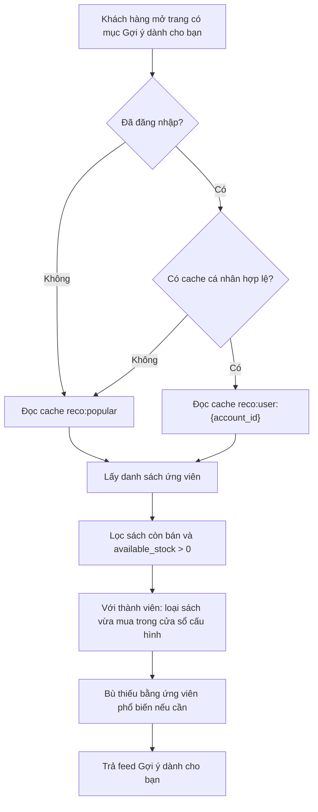
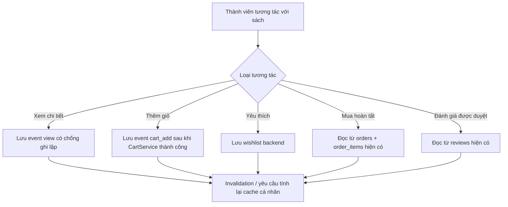
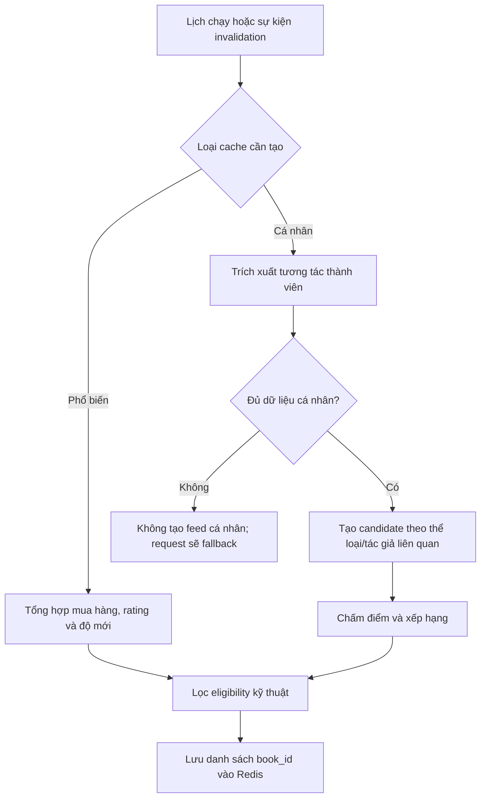

# Kế hoạch triển khai hệ thống đề xuất sách

## 1. Mục tiêu

Xây dựng một mục đề xuất duy nhất mang tên **"Gợi ý dành cho bạn"**, có thể tái sử dụng ở trang chủ, trang chi tiết sách và các vị trí hiển thị khác trên storefront.

Hệ thống cần:

- Trả đề xuất nhanh cho khách vãng lai và thành viên.
- Thu thập đủ dữ liệu tương tác để cá nhân hóa cho thành viên.
- Fallback về đề xuất phổ biến khi thành viên chưa đủ dữ liệu.
- Chỉ hiển thị sách còn tồn kho khả dụng.
- Không chạy thuật toán tính toán nặng trong request hiển thị danh sách.

## 2. Quyết định nghiệp vụ đã chốt

| Nội dung | Quyết định |
| --- | --- |
| Vị trí hiển thị | Một feed duy nhất: `Gợi ý dành cho bạn`, tái sử dụng ở nhiều trang |
| Khách vãng lai | Dùng danh sách phổ biến được tính sẵn |
| Thành viên chưa đủ dữ liệu | Dùng cùng fallback phổ biến như khách vãng lai |
| Thành viên đủ dữ liệu | Dùng kết quả cá nhân hóa được tính sẵn |
| Điều kiện tồn kho | Chỉ trả sách có `available_stock > 0` |
| Công thức tồn kho khả dụng | `SUM(GREATEST(quantity - reserved_quantity, 0)) > 0` |
| Xử lý nặng | Job nền / lịch chạy định kỳ, kết quả lưu Redis |
| Request frontend | Chỉ đọc cache, áp dụng lọc cuối và trả JSON |
| Thuật toán cá nhân hóa | Weighted content-based, không dùng collaborative filtering |

Ghi chú kỹ thuật: dù luồng nghiệp vụ nhấn mạnh tồn kho, API storefront vẫn phải loại sách đã ngừng kinh doanh (`books.is_active = false`) theo quy tắc catalog hiện tại. Quy tắc recommendation của dự án cũng yêu cầu loại sách thành viên vừa mua trong một khoảng thời gian cấu hình để tránh đề xuất lặp lại.

## 3. Phạm vi triển khai

### 3.1. Phạm vi MVP

MVP dưới đây là đích đến sau nhiều lát triển khai nhỏ; không triển khai toàn bộ trong một lần thay đổi.

- API đọc feed `Gợi ý dành cho bạn`.
- Feed phổ biến cho khách vãng lai và thành viên thiếu dữ liệu.
- Feed cá nhân hóa đơn giản cho thành viên dựa trên tương tác và metadata sách.
- Thu thập hành vi xem sách, thêm giỏ và yêu thích của thành viên.
- Tái sử dụng dữ liệu mua hàng hoàn tất và đánh giá đã duyệt hiện có.
- Cache Redis, queue job và lịch tính trước kết quả.
- Kết nối frontend vào một feed duy nhất.

### 3.2. Chưa làm trong MVP

- Cá nhân hóa cho khách vãng lai qua cookie/session ẩn danh.
- A/B testing thuật toán.
- Dashboard phân tích recommendation nâng cao.

### 3.3. Ngoài phạm vi hệ thống

- Không triển khai collaborative filtering, matrix factorization hoặc mô hình dựa trên người dùng tương tự.
- Dữ liệu hiện tại không đủ để xây ma trận user-item có chất lượng; thêm hướng xử lý này làm tăng độ phức tạp mà không có cơ sở bảo đảm kết quả.
- Nâng cấp sau MVP chỉ tập trung vào hiệu chỉnh trọng số content-based/popularity, đo lường hiệu quả và bổ sung tín hiệu tương tác khi cần.

### 3.4. Nguyên tắc triển khai theo lát mỏng

Mỗi lát phải độc lập triển khai, kiểm thử và demo được trước khi chuyển sang lát sau:

- Bắt đầu từ khả năng hệ thống chưa có: lưu sở thích và lịch sử tương tác ở backend.
- Không xây scoring, cache cá nhân hoặc scheduler trước khi đã thu được dữ liệu đầu vào thật.
- Chỉ thêm một đường dữ liệu hoặc một hành vi người dùng đáng kể trong mỗi lát.
- Mỗi lát phải có test cho hợp đồng API hoặc business rule mới được thêm.
- Các lát đầu có thể chưa làm thay đổi mục `Gợi ý dành cho bạn`; giá trị demo ban đầu là dữ liệu sở thích/tương tác đã tồn tại bền vững và sẵn sàng làm đầu vào recommendation.
- Endpoint recommendation chỉ xuất hiện khi đã có feed phổ biến tối thiểu có thể hiển thị thực tế.

### 3.5. Đồng bộ quy ước dự án trước khi code recommendation

Rule hiện tại tại `.cursor/rules/recommendation-system.mdc` vẫn mô tả thành viên sử dụng collaborative filtering. Trước khi triển khai lát có tính feed (`Lát 4` trở đi), cần cập nhật rule này để:

- Thay yêu cầu collaborative filtering bằng weighted content-based cho thành viên đủ dữ liệu.
- Giữ nguyên fallback popular cho khách vãng lai và thành viên thiếu dữ liệu.
- Giữ các yêu cầu lọc tồn kho, chạy job nền và cache Redis.

Việc đồng bộ rule tránh để tài liệu nghiệp vụ và hướng dẫn triển khai code mâu thuẫn nhau.

## 4. Hiện trạng hệ thống và khoảng trống dữ liệu

### 4.1. Dữ liệu đã có thể tái sử dụng

| Tín hiệu | Bảng hiện có | Điều kiện sử dụng | Độ mạnh |
| --- | --- | --- | --- |
| Mua sách | `orders`, `order_items` | `orders.current_status = completed` | Rất mạnh |
| Đánh giá | `reviews` | `reviews.status = approved` | Rất mạnh |
| Nội dung sách | `books`, `book_categories`, `book_authors`, `book_details` | Sách storefront hợp lệ | Dùng tạo similarity |
| Tồn kho | `inventories` | Tính `quantity - reserved_quantity` | Điều kiện trả kết quả |

### 4.2. Dữ liệu cần bổ sung

| Tín hiệu | Hiện trạng | Bổ sung cần làm |
| --- | --- | --- |
| Xem trang chi tiết sách | Chưa lưu | Ghi event `view` cho thành viên |
| Thêm sách vào giỏ | Chỉ lưu trạng thái giỏ hiện tại | Ghi event `cart_add` sau thao tác thành công |
| Yêu thích sách | Frontend đang lưu cục bộ | Tạo wishlist backend và dùng trạng thái wishlist làm tín hiệu |
| Click từ feed đề xuất | Chưa lưu | Bổ sung sau MVP hoặc lưu event `recommendation_click` nếu cần đo hiệu quả ngay |

`carts` và `cart_items` không thay thế được lịch sử tương tác vì item có thể bị cập nhật hoặc xóa. Muốn dùng hành vi thêm giỏ làm tín hiệu dài hạn phải lưu event riêng.

## 5. Luồng nghiệp vụ mục tiêu

### 5.1. Luồng trả feed cho người dùng



API không thực hiện chấm điểm hoặc tổng hợp nặng trong luồng này.

### 5.2. Luồng thu thập tương tác



### 5.3. Luồng tính kết quả nền



## 6. Thiết kế dữ liệu bổ sung

### 6.1. Bảng `book_interaction_events`

Mục đích: lưu lịch sử hành vi có thể mất đi nếu chỉ dựa vào dữ liệu trạng thái hiện tại.

| Cột | Kiểu gợi ý | Ý nghĩa |
| --- | --- | --- |
| `id` | `bigint unsigned` | Khóa chính |
| `account_id` | `bigint unsigned` | Thành viên thực hiện tương tác |
| `book_id` | `bigint unsigned` | Sách được tương tác |
| `event_type` | `varchar(30)` | `view`, `cart_add`; có thể mở rộng `recommendation_click` |
| `source` | `varchar(30) nullable` | `home`, `book_detail`, `catalog`, dùng đo lường về sau |
| `created_at` | `timestamp nullable` | Thời điểm tương tác |

Ràng buộc và index:

- Foreign key `account_id -> accounts.id`, `ON DELETE CASCADE`.
- Foreign key `book_id -> books.id`, `ON DELETE CASCADE`.
- Index `book_interaction_events_account_id_event_type_created_at_index`.
- Index `book_interaction_events_account_id_book_id_created_at_index`.
- Index `book_interaction_events_book_id_event_type_created_at_index` nếu cần báo cáo/popularity.

Quy tắc ghi event:

- Chỉ ghi `view` cho thành viên đã đăng nhập trong MVP.
- Chống spam refresh: tối đa một event `view` cho cùng `account_id` và `book_id` trong 30 phút.
- Ghi `cart_add` khi thao tác thêm giỏ thành công; không ghi nếu validation tồn kho thất bại.
- Không sao chép `purchase` hoặc `rating` vào bảng event; các bảng giao dịch hiện có là nguồn sự thật.
- Thiết lập job dọn event hành vi cũ, mặc định giữ 180 ngày; thời hạn này đưa vào config.

### 6.2. Bảng `wishlists`

Mục đích: chuyển yêu thích từ local state frontend thành dữ liệu sở thích bền vững và đồng bộ theo tài khoản.

| Cột | Kiểu gợi ý | Ý nghĩa |
| --- | --- | --- |
| `id` | `bigint unsigned` | Khóa chính |
| `account_id` | `bigint unsigned` | Chủ sở hữu |
| `book_id` | `bigint unsigned` | Sách yêu thích |
| `created_at`, `updated_at` | `timestamp nullable` | Theo chuẩn Laravel |

Ràng buộc và index:

- Unique `wishlists_account_id_book_id_unique`.
- Foreign key về `accounts` và `books`, `ON DELETE CASCADE`.
- Không cần lưu event `wishlist_add` trong MVP: một hàng wishlist đang tồn tại đã là tín hiệu sở thích rõ ràng.

### 6.3. Cập nhật tài liệu schema

Sau từng lát tạo migration và chạy ổn định, cập nhật `backend/docs/database_schema.md`: thêm `wishlists` ở lát 1, sau đó thêm `book_interaction_events` ở lát 2.

## 7. Định nghĩa tín hiệu và ngưỡng dữ liệu

### 7.1. Nguồn tín hiệu cá nhân

| Nguồn | Điều kiện lấy dữ liệu | Trọng số khởi điểm |
| --- | --- | ---: |
| `book_interaction_events.view` | Trong 90 ngày gần nhất | 1 |
| `book_interaction_events.cart_add` | Trong 90 ngày gần nhất | 3 |
| `wishlists` | Đang tồn tại | 4 |
| `order_items` | Đơn hàng `completed`, trong 365 ngày gần nhất | 5 |
| `reviews` rating 4-5 | Review `approved` | 5 |
| `reviews` rating 3 | Review `approved` | 0 |
| `reviews` rating 1-2 | Review `approved` | -3 |

Các trọng số và cửa sổ thời gian đặt trong `config/recommendation.php`, không hardcode rải rác trong service.

### 7.2. Ngưỡng đủ dữ liệu cá nhân cho MVP

Thành viên được xem là đủ dữ liệu để tạo feed cá nhân khi thỏa cả hai điều kiện:

- Có tương tác với ít nhất `5` sách khác nhau trong cửa sổ dữ liệu.
- Có ít nhất `1` tín hiệu mạnh: wishlist, đơn hoàn tất hoặc review đã duyệt.

Nếu không đạt, không tạo cache cá nhân; endpoint tự động dùng `reco:popular`.

### 7.3. Giới hạn dữ liệu và lựa chọn thuật toán

Ngưỡng cá nhân ở trên chỉ dùng để quyết định có đủ tín hiệu xây feed content-based cho một thành viên hay không.

Hệ thống không sử dụng collaborative filtering vì dữ liệu hiện tại không bảo đảm:

- Có đủ thành viên đã tương tác.
- Có đủ giao nhau giữa sách được các thành viên tương tác.
- Có lịch sử tương tác đủ dài để đánh giá mô hình dựa trên hành vi tương tự.

Khi dữ liệu tăng lên, việc cải thiện chất lượng vẫn thực hiện trong phạm vi `popular` và `content_based`, ví dụ hiệu chỉnh trọng số, cửa sổ thời gian và metric đo lường.

## 8. Chiến lược đề xuất

### 8.1. Feed phổ biến `popular`

Đối tượng sử dụng:

- Khách vãng lai.
- Thành viên chưa đủ dữ liệu.
- Thành viên bị cache miss trong lúc chờ tính lại feed cá nhân.

Ứng viên được chấm điểm từ:

- Số lượng bán từ các đơn hoàn tất trong khoảng thời gian cấu hình.
- `books.average_rating` và `books.review_count`, vốn đã tổng hợp từ review được duyệt.
- Độ mới của `books.created_at` để danh sách không chỉ gồm sách cũ.

Kết quả lưu nhiều hơn số item hiển thị, ví dụ lưu top `50` ứng viên để có thể bù sách bị hết tồn kho ở thời điểm request.

### 8.2. Feed cá nhân hóa MVP

Strategy: weighted content-based recommendation.

1. Trích xuất các sách người dùng đã tương tác và trọng số tương ứng.
2. Lấy category và author từ các sách có điểm dương.
3. Cộng điểm cho sách ứng viên chia sẻ category/author, ưu tiên tín hiệu mạnh.
4. Trừ điểm hoặc loại ứng viên quá gần với sách bị đánh giá thấp.
5. Loại sách người dùng vừa mua trong cửa sổ cấu hình.
6. Kết hợp một tỷ lệ nhỏ điểm popularity để xử lý ứng viên đồng điểm và tránh danh sách quá hẹp.
7. Lưu danh sách book ID đã xếp hạng vào cache cá nhân.

Cách này phù hợp với nguồn dữ liệu dự án: mỗi thành viên được gợi ý từ thể loại/tác giả của các sách họ đã quan tâm, không phụ thuộc hành vi của số đông người dùng khác.

### 8.3. Cải tiến chất lượng sau MVP

Các cải tiến vẫn giữ nguyên hai strategy `popular` và `content_based`:

- Đo impression, click, add-to-cart và purchase conversion của feed.
- Hiệu chỉnh trọng số tín hiệu và cửa sổ thời gian từ kết quả đo.
- Bổ sung nguồn tín hiệu như click trên item đề xuất nếu thực sự cần.
- Giữ nguyên cache key và response contract để frontend không cần thay đổi.

## 9. Quy tắc lọc kết quả

### 9.1. Lọc bắt buộc ở lớp tính candidate

- Không chọn sách `books.is_active = false`.
- Với feed cá nhân, loại sách thành viên đã mua gần đây; đề xuất mặc định cấu hình `recent_purchase_exclusion_days = 90`.

### 9.2. Lọc cuối ở thời điểm request

Tồn kho thay đổi nhanh do giữ hàng khi checkout, vì vậy endpoint phải kiểm tra lại tồn kho ngay trước khi trả kết quả:

```sql
SUM(GREATEST(inventories.quantity - inventories.reserved_quantity, 0)) > 0
```

Nếu danh sách cache không còn đủ số lượng do hết kho:

1. Lấy các ứng viên còn lại trong cache đã lưu dư.
2. Nếu vẫn thiếu, bù từ `reco:popular`.
3. Không trả sách có `available_stock <= 0`.

Có thể tái sử dụng logic hiện có trong `App\Services\Catalog\BookStockAvailabilityService` hoặc truy vấn bulk tương đương để tránh N+1 query.

## 10. Thiết kế backend

### 10.1. Thành phần mới dự kiến

| Thành phần | Trách nhiệm |
| --- | --- |
| `App\Enums\Recommendation\BookInteractionType` | Giá trị `view`, `cart_add` |
| `App\Models\BookInteractionEvent` | Model event tương tác |
| `App\Models\Wishlist` | Model wishlist |
| `App\Services\Recommendation\InteractionTrackingService` | Ghi view/cart event, chống ghi trùng; invalidation được nối ở lát 7 |
| `App\Services\Recommendation\RecommendationService` | Đọc feed cache, fallback, lọc cuối và bù item |
| `App\Services\Recommendation\RecommendationCandidateService` | Truy vấn/chấm điểm candidate |
| `App\Services\Recommendation\RecommendationCacheService` | Quy ước key, TTL, read/write/forget có xử lý lỗi |
| `App\Jobs\Recommendation\BuildPopularRecommendations` | Tính `reco:popular` |
| `App\Jobs\Recommendation\BuildUserRecommendations` | Tính `reco:user:{account_id}` |
| `App\Console\Commands\DispatchRecommendationBuildsCommand` | Dispatch batch tính recommendation định kỳ |
| `App\Http\Controllers\Api\V1\Recommendation\RecommendationController` | Endpoint feed duy nhất |
| `App\Http\Controllers\Api\V1\Account\WishlistController` | CRUD wishlist |
| `App\Http\Controllers\Api\V1\Recommendation\InteractionController` | Endpoint ghi view |
| `App\Http\Resources\RecommendedBookResource` | JSON resource item feed |
| `App\Http\Requests\Recommendation\ListRecommendationsRequest` | Validate `limit` |
| `App\Http\Requests\Recommendation\TrackBookViewRequest` | Validate nguồn hiển thị nếu dùng `source` |

### 10.2. Điểm tích hợp vào code hiện có

| Tác vụ | Điểm tích hợp | Hành động recommendation |
| --- | --- | --- |
| Người dùng xem chi tiết | Frontend gọi endpoint tracking sau khi load book detail | Ghi `view`; từ lát 7 mới invalidate feed user |
| Thêm giỏ thành công | `App\Services\Cart\CartService::addItem()` sau transaction commit, khi cart thuộc account | Ghi `cart_add`; từ lát 7 mới invalidate feed user |
| Thêm/xóa wishlist | `WishlistController` qua service riêng | Lưu sở thích; từ lát 7 mới invalidate feed user |
| Đơn chuyển sang hoàn tất | `App\Services\Order\OrderStatusTransitionService::deliverOrder()` sau commit | Từ lát 7, invalidate và dispatch rebuild cho account |
| Review được admin duyệt/đổi trạng thái | Mở rộng `App\Observers\ReviewObserver` sau khi xác định review approved thay đổi | Từ lát 7, invalidate và dispatch rebuild cho account |
| Tồn kho thay đổi | `InventoryObserver` đã xử lý dữ liệu catalog/search | Không bắt buộc rebuild; request lọc tồn kho lại |

Tất cả invalidation/dispatch liên quan ghi dữ liệu giao dịch phải chạy sau commit để không sinh recommendation từ thay đổi đã rollback.

### 10.3. Không đưa logic nghiệp vụ vào model

Models chỉ khai báo relationship/cast/scope. Chấm điểm, ngưỡng dữ liệu, lọc recommendation và tracking phải ở service/job theo kiến trúc hiện tại.

## 11. API contract

Các API dưới đây là hợp đồng mục tiêu. Chúng được đưa vào hệ thống theo lát: wishlist và ghi lượt xem trước, endpoint feed sau khi có popular builder.

### 11.1. Lấy feed `Gợi ý dành cho bạn`

```http
GET /api/v1/recommendations?limit=10
```

Authentication:

- Cho phép khách vãng lai.
- Với request có session Sanctum hợp lệ, trả feed cá nhân nếu có cache hợp lệ.

Response gợi ý:

```json
{
  "data": [
    {
      "id": 101,
      "name": "Tên sách",
      "slug": "ten-sach",
      "thumbnail_url": "https://...",
      "selling_price": "95000.00",
      "original_price": "120000.00",
      "authors": [],
      "average_rating": "4.50",
      "review_count": 12,
      "available_stock": 8
    }
  ],
  "meta": {
    "feed": "for_you",
    "strategy": "popular"
  }
}
```

`strategy` có thể là `popular` hoặc `content_based`; trường này hỗ trợ kiểm thử và đo lường, không dùng để đổi UI.

### 11.2. Ghi lượt xem sách

```http
POST /api/v1/recommendations/interactions/books/{book}/view
```

- Middleware: `web`, `auth:sanctum`, `account.active`, throttle.
- Body tùy chọn: `{ "source": "book_detail" }`.
- Response: `204 No Content`.
- Service tự chống ghi lặp trong 30 phút.

### 11.3. Wishlist

```http
GET    /api/v1/account/wishlist
POST   /api/v1/account/wishlist/items
DELETE /api/v1/account/wishlist/items/{book}
```

- Chỉ cho thành viên đăng nhập.
- `POST` nhận `book_id`, ghi idempotent theo unique constraint.
- Từ lát tự động hóa cá nhân hóa trở đi, thêm hoặc xóa thành công đều invalidates feed cá nhân; các lát dữ liệu đầu tiên chưa có cache cần xóa.

### 11.4. Ghi nhận thêm giỏ

Không cần endpoint mới. `CartService::addItem()` là nguồn thao tác đã có và gọi tracking nội bộ cho thành viên sau khi thêm thành công.

## 12. Cache, queue và scheduler

### 12.1. Cache keys và TTL

| Key | Nội dung | TTL |
| --- | --- | --- |
| `reco:popular` | Candidate book IDs cho fallback phổ biến | 6 giờ |
| `reco:user:{account_id}` | Candidate book IDs và strategy cho thành viên | 1 giờ |

Payload cache đề xuất:

```json
{
  "strategy": "content_based",
  "generated_at": "2026-05-27T12:00:00Z",
  "book_ids": [101, 205, 37]
}
```

Cache chỉ lưu candidate IDs và metadata nhỏ; resource sách và tồn kho được tải theo ID khi trả response để phản ánh trạng thái hiện tại.

### 12.2. Invalidation

Các invalidation dưới đây chỉ được nối ở lát tự động hóa sau khi cache tương ứng đã được triển khai. Lát 1 đến lát 3 chỉ lưu dữ liệu đầu vào, chưa phụ thuộc Redis recommendation.

| Sự kiện | Key bị xóa | Hành động sau xóa |
| --- | --- | --- |
| View/cart add/wishlist của thành viên | `reco:user:{account_id}` | Có thể dispatch user rebuild với debounce |
| Đơn hoàn tất | `reco:user:{account_id}`, `reco:popular` | Dispatch rebuild user; popular được lịch định kỳ cập nhật |
| Review trở thành approved hoặc rating approved thay đổi | `reco:user:{account_id}`, `reco:popular` | Dispatch rebuild user; popular được lịch định kỳ cập nhật |

Endpoint không tính recommendation thay thế trong request. Khi Redis lỗi hoặc cache chưa được warm, endpoint trả danh sách rỗng an toàn (hoặc payload cache gần nhất nếu có lớp lưu dự phòng được triển khai rõ ràng), log warning và frontend ẩn section; lỗi cache không được làm hỏng trang storefront.

### 12.3. Queue jobs và lịch chạy

Scheduler được thêm sau khi endpoint popular đã demo thành công với cache được build thủ công. Không đưa toàn bộ job/lịch vào lát nền dữ liệu đầu tiên.

Thêm dần vào `routes/console.php`:

| Lịch | Công việc |
| --- | --- |
| Mỗi giờ | Dispatch build/rebuild feed cá nhân cho account đủ điều kiện hoặc có tương tác gần đây |
| Mỗi 6 giờ | Build feed phổ biến |
| Hàng ngày | Xóa `book_interaction_events` cũ hơn thời gian retention |

Các job dùng Redis queue, có `tries`, `backoff`, logging khi thất bại và không chạy đồng thời trùng key nếu một build cùng loại đang xử lý.

## 13. Cấu hình dự kiến

Tạo `backend/config/recommendation.php`:

```php
return [
    'display_limit' => 10,
    'candidate_limit' => 50,
    'personalized_ttl_seconds' => 3600,
    'popular_ttl_seconds' => 21600,
    'view_deduplication_minutes' => 30,
    'interaction_retention_days' => 180,
    'recent_purchase_exclusion_days' => 90,
    'minimum_distinct_books' => 5,
    'weights' => [
        'view' => 1,
        'cart_add' => 3,
        'wishlist' => 4,
        'purchase' => 5,
        'positive_rating' => 5,
        'negative_rating' => -3,
    ],
];
```

Runtime prerequisites:

- `CACHE_STORE=redis`.
- `QUEUE_CONNECTION=redis`.
- Redis worker đang chạy để xử lý build jobs.
- Scheduler Laravel đang chạy để tạo lại cache định kỳ.

Meilisearch có thể hỗ trợ lấy candidate theo catalog về sau, nhưng MVP không phụ thuộc vector search hoặc Gemini.

## 14. Frontend integration

### 14.1. Feed duy nhất

Việc thay section hiện tại bằng API recommendation thuộc lát feed phổ biến, không thuộc lát tạo bảng dữ liệu ban đầu.

Thay logic hiện tại đang lấy một đoạn của danh sách sách catalog trong section `Gợi Ý Cho Bạn` bằng API recommendation:

```text
HomePage / trang hiển thị bất kỳ
        |
GET /api/v1/recommendations?limit=10
        |
Render cùng component ProductCard/ProductSlider
```

Tất cả trang sử dụng cùng endpoint; không truyền `book_id` hoặc ngữ cảnh trang để thay đổi loại recommendation.

### 14.2. Tracking

- Lát 1: chuyển wishlist hiện có sang gọi API backend.
- Lát 2: gọi API `view` khi thành viên mở chi tiết sách thành công.
- Lát 3: backend gắn tracking `cart_add` tại thao tác giỏ đã có; frontend không gọi tracking giỏ riêng.
- Lát feed: frontend thay dữ liệu section `Gợi Ý Cho Bạn` bằng endpoint recommendation.

### 14.3. Trải nghiệm lỗi

- Nếu API recommendation lỗi hoặc chưa có cache được warm, ẩn section; không chặn tải trang và không tính feed thay thế trong request.
- Không hiển thị message giải thích strategy cho khách hàng; `meta.strategy` chỉ phục vụ kỹ thuật/đo lường.

## 15. Kiểm thử theo lát

### 15.1. Lát 1 - wishlist backend

- Tạo/xóa migration `wishlists` thành công.
- Unique wishlist chặn thêm trùng; foreign key và indexes đúng schema dự kiến.
- Thành viên thêm, xem danh sách và xóa wishlist qua API.
- Wishlist còn tồn tại sau khi tải lại giao diện hoặc đăng nhập lại.
- Chưa yêu cầu bảng event, cache recommendation hoặc scoring trong test của lát này.

### 15.2. Lát 2 - lượt xem

- Tạo/xóa migration `book_interaction_events` thành công.
- Thành viên xem sách tạo event `view`.
- Xem cùng sách trong 30 phút không tạo event lặp.
- Khách vãng lai không tạo event trong MVP.

### 15.3. Lát 3 - sự kiện giỏ hàng

- Thêm giỏ thành công của thành viên tạo `cart_add`.
- Thêm giỏ thất bại vì tồn kho không tạo event.
- Khách vãng lai thêm giỏ không tạo tương tác phục vụ cá nhân hóa.
- Lỗi ghi tracking không làm rollback thao tác thêm giỏ đã thành công và được log.

### 15.4. Lát 4 - feed phổ biến

- Khách vãng lai và thành viên đều đọc feed strategy `popular`.
- Job popular tạo cache candidate để endpoint đọc.
- Không trả sách có `available_stock <= 0`.
- Không trả sách inactive.
- Cache chứa item hết kho vẫn bù từ candidate còn khả dụng.
- Section `Gợi Ý Cho Bạn` hiển thị dữ liệu API thay cho `slice()` từ catalog.

### 15.5. Lát 5 - vận hành feed phổ biến

- Job popular lưu `reco:popular` với TTL 6 giờ.
- Schedule dispatch đúng tần suất và job không chạy trùng không cần thiết.
- Redis exception được log và endpoint degrade gracefully.

### 15.6. Lát 6 - cá nhân hóa

- Người dùng dưới ngưỡng nhận strategy `popular`.
- Người dùng đủ `5` sách khác nhau nhưng không có tín hiệu mạnh vẫn fallback.
- Người dùng đủ ngưỡng và có wishlist/purchase/approved review được build feed cá nhân.
- Review pending/rejected không được dùng làm tín hiệu.
- Đơn chưa completed không được dùng làm tín hiệu mua.
- Thành viên có cache cá nhân đọc feed cá nhân; cache miss fallback popular.
- Không trả sách vừa mua trong feed cá nhân theo cửa sổ cấu hình.
- Job user lưu `reco:user:{account_id}` với TTL 1 giờ.

### 15.7. Lát 7 - tự động hóa cá nhân hóa

- Thêm/xóa wishlist hoặc ghi tương tác làm mất cache cá nhân.
- Hoàn tất đơn hàng hoặc duyệt review invalidates đúng user cache sau commit.
- Lịch build user và dọn event chạy đúng tần suất.

### 15.8. Frontend toàn bộ MVP

- Component feed dùng lại được ở các trang mà không thay đổi API contract.
- Tracking view không chặn render chi tiết sách nếu request tracking thất bại.

## 16. Quan sát và đánh giá chất lượng

### 16.1. Logging tối thiểu

- Thời gian chạy và số candidate của mỗi build job.
- Cache hit/miss cho popular và user feed.
- Số account không đủ ngưỡng dữ liệu.
- Lỗi Redis hoặc lỗi truy vấn khi build.

### 16.2. Metric nên bổ sung sau MVP

- Impression của feed.
- Click trên item được đề xuất.
- Add-to-cart từ feed.
- Purchase conversion từ feed.
- Tỷ lệ endpoint phải fallback từ personalized về popular.

Khi cần đo conversion chính xác, bổ sung event `recommendation_impression` và `recommendation_click` cùng `request_id`/`strategy`; không bắt buộc cho lần triển khai đầu.

## 17. Trình tự triển khai theo lát mỏng

### Lát 1: Wishlist backend có thể sử dụng ngay

Mục tiêu: chuyển sở thích đang chỉ tồn tại ở frontend thành dữ liệu backend bền vững, với phạm vi nhỏ nhất có kết quả demo trực quan.

Phạm vi:

- Tạo migration và model `Wishlist`.
- Tạo API wishlist: lấy danh sách, thêm sách, xóa sách.
- Kết nối wishlist frontend hiện có vào backend cho thành viên đăng nhập.
- Cập nhật `backend/docs/database_schema.md`.
- Viết feature tests cho API, unique constraint và authorization.

Chưa làm:

- Không tạo bảng interaction event.
- Không ghi `view` hoặc `cart_add`.
- Không tạo endpoint recommendation.
- Không có Redis key `reco:*`, scoring, job hoặc scheduler.

Kết quả demo:

- Thành viên thêm một sách vào yêu thích, tải lại trang hoặc đăng nhập lại vẫn xem được sách đã lưu.

### Lát 2: Ghi nhận lượt xem sách

Mục tiêu: bắt đầu thu thập interaction đầu tiên mà không thay đổi feed recommendation.

Phạm vi:

- Tạo migration và model `BookInteractionEvent`.
- Tạo enum `BookInteractionType` với loại đầu tiên `view`.
- Tạo `InteractionTrackingService` và endpoint ghi `view`.
- Xử lý chống ghi lặp cùng sách của cùng thành viên trong 30 phút.
- Frontend gọi tracking `view` ở trang chi tiết sau khi tải sách thành công.
- Cập nhật `backend/docs/database_schema.md`.
- Viết feature tests cho endpoint và view deduplication.

Chưa làm:

- Không ghi `cart_add`.
- Không dùng event để tính recommendation.

Kết quả demo:

- Thành viên mở trang chi tiết sách; backend có lịch sử `view` không bị nhân bản khi refresh liên tục.

### Lát 3: Thu thập tín hiệu ý định mua từ giỏ hàng

Mục tiêu: bổ sung tín hiệu có giá trị cao hơn lượt xem mà không thay đổi UI recommendation.

Phạm vi:

- Mở rộng enum/event cho `cart_add`.
- Gắn `InteractionTrackingService` vào `CartService::addItem()` sau khi thao tác thành công và chỉ với thành viên.
- Bảo đảm lỗi tracking không làm thất bại thao tác thêm giỏ đã hợp lệ; lỗi phải được log.
- Viết test cho trường hợp thêm giỏ thành công, thất bại do tồn kho và khách vãng lai.

Kết quả demo:

- Khi thành viên xem, yêu thích và thêm giỏ các sách, database đã có dữ liệu đầu vào đủ phong phú để bắt đầu giải thích cơ chế cá nhân hóa.

### Lát 4: Feed phổ biến đầu tiên hiển thị trên giao diện

Mục tiêu: đưa mục `Gợi Ý Cho Bạn` sử dụng dữ liệu recommendation thực thay cho `slice()` từ catalog.

Phạm vi:

- Tạo `config/recommendation.php` chỉ với cấu hình cần cho popular feed.
- Tạo `RecommendationCacheService`, `RecommendationService`, resource, request và endpoint `GET /api/v1/recommendations`.
- Tạo `BuildPopularRecommendations` để tính candidate bán chạy/đánh giá cao/mới và ghi `reco:popular`.
- Ở lát này cho phép chạy job hoặc command build thủ công trước buổi demo; chưa bắt buộc scheduler.
- Endpoint đọc cache popular, tải sách hiện hành, lọc `is_active = true` và `available_stock > 0`, bù candidate thiếu.
- Frontend thay section hiện có bằng endpoint feed duy nhất.
- Viết test endpoint và job popular.

Kết quả demo:

- Khách vãng lai và thành viên nhìn thấy cùng một mục `Gợi Ý Cho Bạn` có dữ liệu được xây từ logic phổ biến và không chứa sách hết hàng.

### Lát 5: Vận hành ổn định feed phổ biến

Mục tiêu: biến demo popular feed thành chức năng có thể chạy liên tục.

Phạm vi:

- Thêm schedule build `reco:popular` mỗi 6 giờ trong `routes/console.php`.
- Thêm xử lý cache error/logging; khi cache chưa được warm, endpoint trả rỗng và frontend ẩn section thay vì tính trong request.
- Thêm chống job trùng hoặc lock khi rebuild.
- Thêm kiểm thử schedule, TTL và lỗi Redis/fallback.

Kết quả demo:

- Popular feed tự được refresh, không cần thao tác build thủ công và không làm hỏng storefront nếu Redis gặp lỗi.

### Lát 6: Cá nhân hóa content-based đầu tiên

Mục tiêu: dùng dữ liệu đã tích lũy ở các lát đầu để tạo khác biệt thực giữa các thành viên.

Phạm vi:

- Bổ sung đủ cấu hình trọng số, threshold và thời gian loại sách vừa mua.
- Tạo `RecommendationCandidateService` và `BuildUserRecommendations`.
- Tính weighted content-based từ view, cart add, wishlist, đơn `completed` và review `approved`.
- Tạo `reco:user:{account_id}` khi đạt ngưỡng; không đạt thì endpoint vẫn đọc popular.
- Loại sách thành viên vừa mua và kiểm tra tồn kho tại request.
- Cho phép build cá nhân thủ công hoặc dispatch riêng cho tài khoản demo trước khi tự động hóa.
- Viết test scoring ở mức hành vi, threshold, recent purchase exclusion và fallback.

Kết quả demo:

- Hai tài khoản có lịch sử tương tác khác nhau nhận danh sách `Gợi Ý Cho Bạn` khác nhau; tài khoản chưa đủ dữ liệu nhận popular feed.

### Lát 7: Tự động tính lại cá nhân hóa

Mục tiêu: kết quả cá nhân tự cập nhật theo hành vi nghiệp vụ thực.

Phạm vi:

- Invalidate/dispatch rebuild sau view, cart add và thay đổi wishlist với debounce phù hợp.
- Gắn hook sau commit khi đơn chuyển `completed`.
- Gắn hook khi review chuyển thành `approved` hoặc rating approved thay đổi.
- Thêm lịch build user hàng giờ và job dọn event theo retention.
- Viết test invalidation, after-commit dispatch, schedule và TTL user cache.

Kết quả demo:

- Sau khi thành viên mua, đánh giá hoặc thay đổi wishlist, feed cá nhân cập nhật mà không cần chạy lệnh thủ công.

### Lát 8: Đo lường và hiệu chỉnh chất lượng

Mục tiêu: cải thiện hai strategy đã triển khai dựa trên dữ liệu thực tế, không mở thêm thuật toán cần dữ liệu đa người dùng.

Phạm vi:

- Thu thập impression/click/conversion nếu cần.
- Đánh giá mật độ interaction và chất lượng content-based/popular.
- Hiệu chỉnh trọng số, cửa sổ tương tác và công thức popularity trong job nền.
- So sánh offline trước và sau khi thay đổi cấu hình.

Kết quả demo:

- Có số liệu giải thích thay đổi trọng số/cấu hình nào cải thiện feed.

## 18. Tiêu chí nghiệm thu

### 18.1. Mốc demo sớm sau lát 1

- Backend đã có wishlist bền vững cho thành viên.
- Wishlist hiện có trên giao diện không còn chỉ phụ thuộc local state/frontend.
- Chưa cam kết có tracking hành vi hoặc mục `Gợi Ý Cho Bạn` được cá nhân hóa ở mốc này.

### 18.2. Mốc dữ liệu tương tác sau lát 3

- Backend lưu được `view` có chống lặp và `cart_add` từ thao tác thành công.
- Người dùng có thể tạo dữ liệu đầu vào recommendation qua xem, yêu thích và thêm giỏ.

### 18.3. Mốc demo feed sau lát 4

- Website hiển thị một mục recommendation có tên `Gợi Ý Cho Bạn`.
- Mục này gọi API recommendation và đang dùng strategy `popular`.
- Không có sách tồn kho khả dụng bằng `0` hoặc sách inactive trong kết quả.

### 18.4. Nghiệm thu MVP sau lát 7

- Website chỉ hiển thị một mục recommendation có tên `Gợi ý dành cho bạn`.
- Mục này gọi cùng một API và tái sử dụng được trên các trang.
- Khách vãng lai và thành viên thiếu dữ liệu đều nhận feed phổ biến.
- Thành viên đủ dữ liệu nhận feed cá nhân hóa content-based.
- Hệ thống lưu được view, cart add và wishlist cho thành viên.
- Purchase chỉ lấy từ đơn `completed`; rating chỉ lấy từ review `approved`.
- Không có sách tồn kho khả dụng bằng `0` trong kết quả API.
- Endpoint không chạy tính toán recommendation nặng trong request.
- Redis cache và jobs chạy đúng TTL/lịch đã quy định.
- Tests cho endpoint, tracking, threshold, lọc tồn kho và invalidation đều đạt.

## 19. File/thành phần dự kiến thay đổi theo lát

| Lát | Khu vực thay đổi chính |
| --- | --- |
| Lát 1 | Migration `wishlists`, schema doc, model/API wishlist, frontend wishlist, tests API |
| Lát 2 | Migration `book_interaction_events`, schema doc, enum, tracking/view API, book-detail tracking, tests event |
| Lát 3 | `InteractionTrackingService`, `CartService`, test event `cart_add` |
| Trước lát 4 | Đồng bộ `.cursor/rules/recommendation-system.mdc` với quyết định chỉ dùng `popular` và `content_based` |
| Lát 4 | Recommendation config tối thiểu, cache/feed service, popular job, recommendation API/resource, frontend feed, tests popular |
| Lát 5 | `routes/console.php`, lock/error handling và tests vận hành popular cache |
| Lát 6 | Candidate/scoring service, user build job, config threshold/weights và tests cá nhân hóa |
| Lát 7 | `OrderStatusTransitionService`, `ReviewObserver`, invalidation/scheduler/retention và tests after-commit |
| Lát 8 | Tracking metric và hiệu chỉnh trọng số/cửa sổ thời gian cho `popular` và `content_based` |

## 20. Rủi ro và biện pháp xử lý

| Rủi ro | Ảnh hưởng | Xử lý |
| --- | --- | --- |
| Dữ liệu cá nhân ít ở giai đoạn đầu | Feed cá nhân chưa đủ tốt | Fallback popular cho tới khi đủ tín hiệu content-based |
| Event view tăng nhanh | Bảng event phình to | Deduplicate 30 phút và retention job |
| Tồn kho thay đổi sau khi cache được build | Trả sách không mua được | Kiểm tra `available_stock` tại request và bù candidate |
| Redis/queue không chạy | Cache không được refresh | Trả feed rỗng an toàn, ẩn section, log lỗi và giám sát worker/scheduler |
| Wishlist hiện ở client | Mất tín hiệu khi đổi trình duyệt | Di chuyển wishlist về backend |
| Giả định có dữ liệu đa người dùng đủ tốt | Thiết kế thuật toán vượt khả năng dữ liệu thực tế | Chỉ triển khai popular và content-based theo dữ liệu của từng thành viên |
