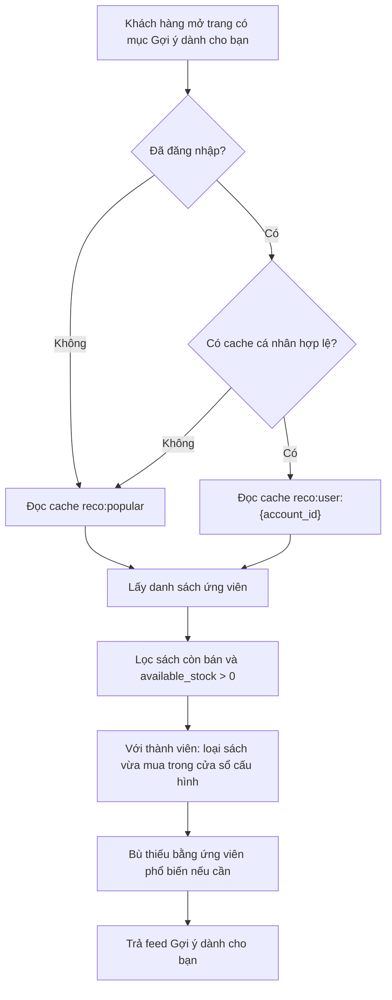
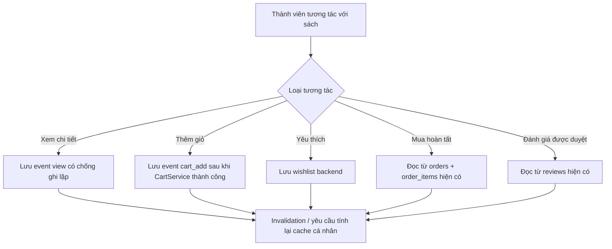
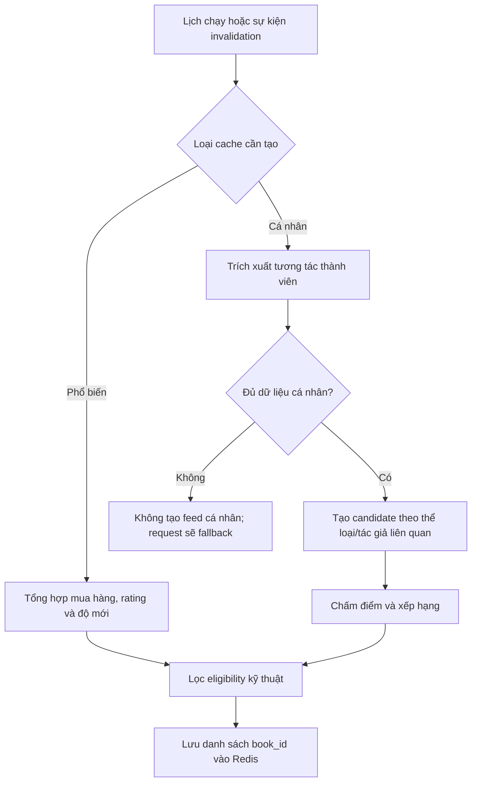

# Kế hoạch triển khai hệ thống đề xuất sách

## 1. Mục tiêu

Xây dựng một mục đề xuất duy nhất mang tên **"Gợi ý dành cho bạn"**, có thể tái sử dụng ở trang chủ, trang chi tiết sách và các vị trí hiển thị khác trên storefront.

Hệ thống cần:

- Trả đề xuất nhanh cho khách vãng lai và thành viên.
- Thu thập đủ dữ liệu tương tác để cá nhân hóa cho thành viên.
- Fallback về đề xuất phổ biến khi thành viên chưa đủ dữ liệu.
- Chỉ hiển thị sách còn tồn kho khả dụng.
- Không chạy thuật toán tính toán nặng trong request hiển thị danh sách.

## 2. Quyết định nghiệp vụ đã chốt

| Nội dung | Quyết định |
| --- | --- |
| Vị trí hiển thị | Một feed duy nhất: `Gợi ý dành cho bạn`, tái sử dụng ở nhiều trang |
| Khách vãng lai | Dùng danh sách phổ biến được tính sẵn |
| Thành viên chưa đủ dữ liệu | Dùng cùng fallback phổ biến như khách vãng lai |
| Thành viên đủ dữ liệu | Dùng kết quả cá nhân hóa được tính sẵn |
| Điều kiện tồn kho | Chỉ trả sách có `available_stock > 0` |
| Công thức tồn kho khả dụng | `SUM(GREATEST(quantity - reserved_quantity, 0)) > 0` |
| Xử lý nặng | Job nền / lịch chạy định kỳ, kết quả lưu Redis |
| Request frontend | Chỉ đọc cache, áp dụng lọc cuối và trả JSON |

Ghi chú kỹ thuật: dù luồng nghiệp vụ nhấn mạnh tồn kho, API storefront vẫn phải loại sách đã ngừng kinh doanh (`books.is_active = false`) theo quy tắc catalog hiện tại. Quy tắc recommendation của dự án cũng yêu cầu loại sách thành viên vừa mua trong một khoảng thời gian cấu hình để tránh đề xuất lặp lại.

## 3. Phạm vi triển khai

### 3.1. Phạm vi MVP

- API đọc feed `Gợi ý dành cho bạn`.
- Feed phổ biến cho khách vãng lai và thành viên thiếu dữ liệu.
- Feed cá nhân hóa đơn giản cho thành viên dựa trên tương tác và metadata sách.
- Thu thập hành vi xem sách, thêm giỏ và yêu thích của thành viên.
- Tái sử dụng dữ liệu mua hàng hoàn tất và đánh giá đã duyệt hiện có.
- Cache Redis, queue job và lịch tính trước kết quả.
- Kết nối frontend vào một feed duy nhất.

### 3.2. Chưa làm trong MVP

- Collaborative filtering/matrix factorization đầy đủ.
- Cá nhân hóa cho khách vãng lai qua cookie/session ẩn danh.
- A/B testing thuật toán.
- Dashboard phân tích recommendation nâng cao.

### 3.3. Giai đoạn nâng cấp

Sau khi có đủ dữ liệu tương tác toàn hệ thống, bổ sung collaborative filtering hoặc hybrid recommendation. Giao diện và endpoint feed không thay đổi; chỉ thay strategy tính kết quả.

## 4. Hiện trạng hệ thống và khoảng trống dữ liệu

### 4.1. Dữ liệu đã có thể tái sử dụng

| Tín hiệu | Bảng hiện có | Điều kiện sử dụng | Độ mạnh |
| --- | --- | --- | --- |
| Mua sách | `orders`, `order_items` | `orders.current_status = completed` | Rất mạnh |
| Đánh giá | `reviews` | `reviews.status = approved` | Rất mạnh |
| Nội dung sách | `books`, `book_categories`, `book_authors`, `book_details` | Sách storefront hợp lệ | Dùng tạo similarity |
| Tồn kho | `inventories` | Tính `quantity - reserved_quantity` | Điều kiện trả kết quả |

### 4.2. Dữ liệu cần bổ sung

| Tín hiệu | Hiện trạng | Bổ sung cần làm |
| --- | --- | --- |
| Xem trang chi tiết sách | Chưa lưu | Ghi event `view` cho thành viên |
| Thêm sách vào giỏ | Chỉ lưu trạng thái giỏ hiện tại | Ghi event `cart_add` sau thao tác thành công |
| Yêu thích sách | Frontend đang lưu cục bộ | Tạo wishlist backend và dùng trạng thái wishlist làm tín hiệu |
| Click từ feed đề xuất | Chưa lưu | Bổ sung sau MVP hoặc lưu event `recommendation_click` nếu cần đo hiệu quả ngay |

`carts` và `cart_items` không thay thế được lịch sử tương tác vì item có thể bị cập nhật hoặc xóa. Muốn dùng hành vi thêm giỏ làm tín hiệu dài hạn phải lưu event riêng.

## 5. Luồng nghiệp vụ mục tiêu

### 5.1. Luồng trả feed cho người dùng



API không thực hiện huấn luyện, collaborative filtering hoặc tổng hợp nặng trong luồng này.

### 5.2. Luồng thu thập tương tác



### 5.3. Luồng tính kết quả nền



## 6. Thiết kế dữ liệu bổ sung

### 6.1. Bảng `book_interaction_events`

Mục đích: lưu lịch sử hành vi có thể mất đi nếu chỉ dựa vào dữ liệu trạng thái hiện tại.

| Cột | Kiểu gợi ý | Ý nghĩa |
| --- | --- | --- |
| `id` | `bigint unsigned` | Khóa chính |
| `account_id` | `bigint unsigned` | Thành viên thực hiện tương tác |
| `book_id` | `bigint unsigned` | Sách được tương tác |
| `event_type` | `varchar(30)` | `view`, `cart_add`; có thể mở rộng `recommendation_click` |
| `source` | `varchar(30) nullable` | `home`, `book_detail`, `catalog`, dùng đo lường về sau |
| `created_at` | `timestamp nullable` | Thời điểm tương tác |

Ràng buộc và index:

- Foreign key `account_id -> accounts.id`, `ON DELETE CASCADE`.
- Foreign key `book_id -> books.id`, `ON DELETE CASCADE`.
- Index `book_interaction_events_account_id_event_type_created_at_index`.
- Index `book_interaction_events_account_id_book_id_created_at_index`.
- Index `book_interaction_events_book_id_event_type_created_at_index` nếu cần báo cáo/popularity.

Quy tắc ghi event:

- Chỉ ghi `view` cho thành viên đã đăng nhập trong MVP.
- Chống spam refresh: tối đa một event `view` cho cùng `account_id` và `book_id` trong 30 phút.
- Ghi `cart_add` khi thao tác thêm giỏ thành công; không ghi nếu validation tồn kho thất bại.
- Không sao chép `purchase` hoặc `rating` vào bảng event; các bảng giao dịch hiện có là nguồn sự thật.
- Thiết lập job dọn event hành vi cũ, mặc định giữ 180 ngày; thời hạn này đưa vào config.

### 6.2. Bảng `wishlists`

Mục đích: chuyển yêu thích từ local state frontend thành dữ liệu sở thích bền vững và đồng bộ theo tài khoản.

| Cột | Kiểu gợi ý | Ý nghĩa |
| --- | --- | --- |
| `id` | `bigint unsigned` | Khóa chính |
| `account_id` | `bigint unsigned` | Chủ sở hữu |
| `book_id` | `bigint unsigned` | Sách yêu thích |
| `created_at`, `updated_at` | `timestamp nullable` | Theo chuẩn Laravel |

Ràng buộc và index:

- Unique `wishlists_account_id_book_id_unique`.
- Foreign key về `accounts` và `books`, `ON DELETE CASCADE`.
- Không cần lưu event `wishlist_add` trong MVP: một hàng wishlist đang tồn tại đã là tín hiệu sở thích rõ ràng.

### 6.3. Cập nhật tài liệu schema

Sau khi tạo migration và chạy ổn định, cập nhật `backend/docs/database_schema.md` để thêm hai bảng mới và index tương ứng.

## 7. Định nghĩa tín hiệu và ngưỡng dữ liệu

### 7.1. Nguồn tín hiệu cá nhân

| Nguồn | Điều kiện lấy dữ liệu | Trọng số khởi điểm |
| --- | --- | ---: |
| `book_interaction_events.view` | Trong 90 ngày gần nhất | 1 |
| `book_interaction_events.cart_add` | Trong 90 ngày gần nhất | 3 |
| `wishlists` | Đang tồn tại | 4 |
| `order_items` | Đơn hàng `completed`, trong 365 ngày gần nhất | 5 |
| `reviews` rating 4-5 | Review `approved` | 5 |
| `reviews` rating 3 | Review `approved` | 0 |
| `reviews` rating 1-2 | Review `approved` | -3 |

Các trọng số và cửa sổ thời gian đặt trong `config/recommendation.php`, không hardcode rải rác trong service.

### 7.2. Ngưỡng đủ dữ liệu cá nhân cho MVP

Thành viên được xem là đủ dữ liệu để tạo feed cá nhân khi thỏa cả hai điều kiện:

- Có tương tác với ít nhất `5` sách khác nhau trong cửa sổ dữ liệu.
- Có ít nhất `1` tín hiệu mạnh: wishlist, đơn hoàn tất hoặc review đã duyệt.

Nếu không đạt, không tạo cache cá nhân; endpoint tự động dùng `reco:popular`.

### 7.3. Điều kiện bật collaborative filtering sau MVP

Ngưỡng cá nhân ở trên chỉ đủ cho content-based personalization. Collaborative filtering chỉ được bật khi dữ liệu toàn hệ thống đủ đặc:

- Có số lượng thành viên đủ dữ liệu tối thiểu được xác định sau khi đo dữ liệu thực tế.
- Có độ giao nhau đáng kể giữa các sách được nhiều thành viên tương tác.
- Kết quả offline cho thấy strategy mới tốt hơn popularity/content-based theo metric đã chọn.

Không ghi cứng ngưỡng toàn hệ thống trước khi có dữ liệu đo lường.

## 8. Chiến lược đề xuất

### 8.1. Feed phổ biến `popular`

Đối tượng sử dụng:

- Khách vãng lai.
- Thành viên chưa đủ dữ liệu.
- Thành viên bị cache miss trong lúc chờ tính lại feed cá nhân.

Ứng viên được chấm điểm từ:

- Số lượng bán từ các đơn hoàn tất trong khoảng thời gian cấu hình.
- `books.average_rating` và `books.review_count`, vốn đã tổng hợp từ review được duyệt.
- Độ mới của `books.created_at` để danh sách không chỉ gồm sách cũ.

Kết quả lưu nhiều hơn số item hiển thị, ví dụ lưu top `50` ứng viên để có thể bù sách bị hết tồn kho ở thời điểm request.

### 8.2. Feed cá nhân hóa MVP

Strategy: weighted content-based recommendation.

1. Trích xuất các sách người dùng đã tương tác và trọng số tương ứng.
2. Lấy category và author từ các sách có điểm dương.
3. Cộng điểm cho sách ứng viên chia sẻ category/author, ưu tiên tín hiệu mạnh.
4. Trừ điểm hoặc loại ứng viên quá gần với sách bị đánh giá thấp.
5. Loại sách người dùng vừa mua trong cửa sổ cấu hình.
6. Kết hợp một tỷ lệ nhỏ điểm popularity để xử lý ứng viên đồng điểm và tránh danh sách quá hẹp.
7. Lưu danh sách book ID đã xếp hạng vào cache cá nhân.

Cách này dùng được ngay khi một thành viên có dữ liệu riêng nhưng hệ thống chưa có đủ dữ liệu chung cho collaborative filtering.

### 8.3. Collaborative filtering sau MVP

Khi đủ dữ liệu, thêm strategy `collaborative` hoặc `hybrid` trong job tính cá nhân:

- Xây implicit-feedback matrix từ view, cart add, wishlist, completed purchase và approved rating.
- Tính ứng viên từ hành vi người dùng tương tự.
- Kết hợp với content-based score để xử lý cold start của sách mới.
- Giữ nguyên cache key và response contract để frontend không cần thay đổi.

## 9. Quy tắc lọc kết quả

### 9.1. Lọc bắt buộc ở lớp tính candidate

- Không chọn sách `books.is_active = false`.
- Với feed cá nhân, loại sách thành viên đã mua gần đây; đề xuất mặc định cấu hình `recent_purchase_exclusion_days = 90`.

### 9.2. Lọc cuối ở thời điểm request

Tồn kho thay đổi nhanh do giữ hàng khi checkout, vì vậy endpoint phải kiểm tra lại tồn kho ngay trước khi trả kết quả:

```sql
SUM(GREATEST(inventories.quantity - inventories.reserved_quantity, 0)) > 0
```

Nếu danh sách cache không còn đủ số lượng do hết kho:

1. Lấy các ứng viên còn lại trong cache đã lưu dư.
2. Nếu vẫn thiếu, bù từ `reco:popular`.
3. Không trả sách có `available_stock <= 0`.

Có thể tái sử dụng logic hiện có trong `App\Services\Catalog\BookStockAvailabilityService` hoặc truy vấn bulk tương đương để tránh N+1 query.

## 10. Thiết kế backend

### 10.1. Thành phần mới dự kiến

| Thành phần | Trách nhiệm |
| --- | --- |
| `App\Enums\Recommendation\BookInteractionType` | Giá trị `view`, `cart_add` |
| `App\Models\BookInteractionEvent` | Model event tương tác |
| `App\Models\Wishlist` | Model wishlist |
| `App\Services\Recommendation\InteractionTrackingService` | Ghi view/cart event, chống ghi trùng, invalidation |
| `App\Services\Recommendation\RecommendationService` | Đọc feed cache, fallback, lọc cuối và bù item |
| `App\Services\Recommendation\RecommendationCandidateService` | Truy vấn/chấm điểm candidate |
| `App\Services\Recommendation\RecommendationCacheService` | Quy ước key, TTL, read/write/forget có xử lý lỗi |
| `App\Jobs\Recommendation\BuildPopularRecommendations` | Tính `reco:popular` |
| `App\Jobs\Recommendation\BuildUserRecommendations` | Tính `reco:user:{account_id}` |
| `App\Console\Commands\DispatchRecommendationBuildsCommand` | Dispatch batch tính recommendation định kỳ |
| `App\Http\Controllers\Api\V1\Recommendation\RecommendationController` | Endpoint feed duy nhất |
| `App\Http\Controllers\Api\V1\Account\WishlistController` | CRUD wishlist |
| `App\Http\Controllers\Api\V1\Recommendation\InteractionController` | Endpoint ghi view |
| `App\Http\Resources\RecommendedBookResource` | JSON resource item feed |
| `App\Http\Requests\Recommendation\ListRecommendationsRequest` | Validate `limit` |
| `App\Http\Requests\Recommendation\TrackBookViewRequest` | Validate nguồn hiển thị nếu dùng `source` |

### 10.2. Điểm tích hợp vào code hiện có

| Tác vụ | Điểm tích hợp | Hành động recommendation |
| --- | --- | --- |
| Người dùng xem chi tiết | Frontend gọi endpoint tracking sau khi load book detail | Ghi `view`, invalidate feed user |
| Thêm giỏ thành công | `App\Services\Cart\CartService::addItem()` sau transaction commit, khi cart thuộc account | Ghi `cart_add`, invalidate feed user |
| Thêm/xóa wishlist | `WishlistController` qua service riêng | Invalidate feed user |
| Đơn chuyển sang hoàn tất | `App\Services\Order\OrderStatusTransitionService::deliverOrder()` sau commit | Invalidate và dispatch rebuild cho account |
| Review được admin duyệt/đổi trạng thái | Mở rộng `App\Observers\ReviewObserver` sau khi xác định review approved thay đổi | Invalidate và dispatch rebuild cho account |
| Tồn kho thay đổi | `InventoryObserver` đã xử lý dữ liệu catalog/search | Không bắt buộc rebuild; request lọc tồn kho lại |

Tất cả invalidation/dispatch liên quan ghi dữ liệu giao dịch phải chạy sau commit để không sinh recommendation từ thay đổi đã rollback.

### 10.3. Không đưa logic nghiệp vụ vào model

Models chỉ khai báo relationship/cast/scope. Chấm điểm, ngưỡng dữ liệu, lọc recommendation và tracking phải ở service/job theo kiến trúc hiện tại.

## 11. API contract

### 11.1. Lấy feed `Gợi ý dành cho bạn`

```http
GET /api/v1/recommendations?limit=10
```

Authentication:

- Cho phép khách vãng lai.
- Với request có session Sanctum hợp lệ, trả feed cá nhân nếu có cache hợp lệ.

Response gợi ý:

```json
{
  "data": [
    {
      "id": 101,
      "name": "Tên sách",
      "slug": "ten-sach",
      "thumbnail_url": "https://...",
      "selling_price": "95000.00",
      "original_price": "120000.00",
      "authors": [],
      "average_rating": "4.50",
      "review_count": 12,
      "available_stock": 8
    }
  ],
  "meta": {
    "feed": "for_you",
    "strategy": "popular"
  }
}
```

`strategy` có thể là `popular`, `content_based` hoặc `hybrid`; trường này hỗ trợ kiểm thử và đo lường, không dùng để đổi UI.

### 11.2. Ghi lượt xem sách

```http
POST /api/v1/recommendations/interactions/books/{book}/view
```

- Middleware: `web`, `auth:sanctum`, `account.active`, throttle.
- Body tùy chọn: `{ "source": "book_detail" }`.
- Response: `204 No Content`.
- Service tự chống ghi lặp trong 30 phút.

### 11.3. Wishlist

```http
GET    /api/v1/account/wishlist
POST   /api/v1/account/wishlist/items
DELETE /api/v1/account/wishlist/items/{book}
```

- Chỉ cho thành viên đăng nhập.
- `POST` nhận `book_id`, ghi idempotent theo unique constraint.
- Thêm hoặc xóa thành công đều invalidates feed cá nhân.

### 11.4. Ghi nhận thêm giỏ

Không cần endpoint mới. `CartService::addItem()` là nguồn thao tác đã có và gọi tracking nội bộ cho thành viên sau khi thêm thành công.

## 12. Cache, queue và scheduler

### 12.1. Cache keys và TTL

| Key | Nội dung | TTL |
| --- | --- | --- |
| `reco:popular` | Candidate book IDs cho fallback phổ biến | 6 giờ |
| `reco:user:{account_id}` | Candidate book IDs và strategy cho thành viên | 1 giờ |

Payload cache đề xuất:

```json
{
  "strategy": "content_based",
  "generated_at": "2026-05-27T12:00:00Z",
  "book_ids": [101, 205, 37]
}
```

Cache chỉ lưu candidate IDs và metadata nhỏ; resource sách và tồn kho được tải theo ID khi trả response để phản ánh trạng thái hiện tại.

### 12.2. Invalidation

| Sự kiện | Key bị xóa | Hành động sau xóa |
| --- | --- | --- |
| View/cart add/wishlist của thành viên | `reco:user:{account_id}` | Có thể dispatch user rebuild với debounce |
| Đơn hoàn tất | `reco:user:{account_id}`, `reco:popular` | Dispatch rebuild user; popular được lịch định kỳ cập nhật |
| Review trở thành approved hoặc rating approved thay đổi | `reco:user:{account_id}`, `reco:popular` | Dispatch rebuild user; popular được lịch định kỳ cập nhật |

Khi Redis lỗi, endpoint vẫn có thể truy vấn fallback phổ biến nhẹ từ database với giới hạn nhỏ và phải log warning; lỗi cache không được làm hỏng trang storefront.

### 12.3. Queue jobs và lịch chạy

Thêm vào `routes/console.php`:

| Lịch | Công việc |
| --- | --- |
| Mỗi giờ | Dispatch build/rebuild feed cá nhân cho account đủ điều kiện hoặc có tương tác gần đây |
| Mỗi 6 giờ | Build feed phổ biến |
| Hàng ngày | Xóa `book_interaction_events` cũ hơn thời gian retention |

Các job dùng Redis queue, có `tries`, `backoff`, logging khi thất bại và không chạy đồng thời trùng key nếu một build cùng loại đang xử lý.

## 13. Cấu hình dự kiến

Tạo `backend/config/recommendation.php`:

```php
return [
    'display_limit' => 10,
    'candidate_limit' => 50,
    'personalized_ttl_seconds' => 3600,
    'popular_ttl_seconds' => 21600,
    'view_deduplication_minutes' => 30,
    'interaction_retention_days' => 180,
    'recent_purchase_exclusion_days' => 90,
    'minimum_distinct_books' => 5,
    'weights' => [
        'view' => 1,
        'cart_add' => 3,
        'wishlist' => 4,
        'purchase' => 5,
        'positive_rating' => 5,
        'negative_rating' => -3,
    ],
];
```

Runtime prerequisites:

- `CACHE_STORE=redis`.
- `QUEUE_CONNECTION=redis`.
- Redis worker đang chạy để xử lý build jobs.
- Scheduler Laravel đang chạy để tạo lại cache định kỳ.

Meilisearch có thể hỗ trợ lấy candidate theo catalog về sau, nhưng MVP không phụ thuộc vector search hoặc Gemini.

## 14. Frontend integration

### 14.1. Feed duy nhất

Thay logic hiện tại đang lấy một đoạn của danh sách sách catalog trong section `Gợi Ý Cho Bạn` bằng API recommendation:

```text
HomePage / trang hiển thị bất kỳ
        |
GET /api/v1/recommendations?limit=10
        |
Render cùng component ProductCard/ProductSlider
```

Tất cả trang sử dụng cùng endpoint; không truyền `book_id` hoặc ngữ cảnh trang để thay đổi loại recommendation.

### 14.2. Tracking

- Khi thành viên mở trang chi tiết sách và dữ liệu sách đã tải thành công, gọi API `view`.
- Khi thêm giỏ, frontend không cần gọi tracking riêng vì backend ghi event tại thao tác giỏ đã có.
- Chuyển wishlist hiện có sang gọi API backend thay vì chỉ lưu state/local storage.

### 14.3. Trải nghiệm lỗi

- Nếu API recommendation lỗi, ẩn section hoặc hiển thị fallback catalog hiện có; không chặn tải trang.
- Không hiển thị message giải thích strategy cho khách hàng; `meta.strategy` chỉ phục vụ kỹ thuật/đo lường.

## 15. Kiểm thử

### 15.1. Migration và model

- Tạo/xóa migration `book_interaction_events` và `wishlists` thành công.
- Unique wishlist chặn thêm trùng.
- Foreign key và indexes đúng schema dự kiến.

### 15.2. Tracking

- Thành viên xem sách tạo event `view`.
- Xem cùng sách trong 30 phút không tạo event lặp.
- Khách vãng lai không tạo event trong MVP.
- Thêm giỏ thành công của thành viên tạo `cart_add`.
- Thêm giỏ thất bại vì tồn kho không tạo event.
- Thêm/xóa wishlist làm mất cache cá nhân.

### 15.3. Eligibility và threshold

- Người dùng dưới ngưỡng nhận strategy `popular`.
- Người dùng đủ `5` sách khác nhau nhưng không có tín hiệu mạnh vẫn fallback.
- Người dùng đủ ngưỡng và có wishlist/purchase/approved review được build feed cá nhân.
- Review pending/rejected không được dùng làm tín hiệu.
- Đơn chưa completed không được dùng làm tín hiệu mua.

### 15.4. Recommendation endpoint

- Khách vãng lai đọc feed phổ biến.
- Thành viên có cache cá nhân đọc feed cá nhân.
- Thành viên cache miss fallback feed phổ biến mà không block request.
- Không trả sách có `available_stock <= 0`.
- Không trả sách inactive.
- Không trả sách vừa mua trong feed cá nhân theo cửa sổ cấu hình.
- Cache chứa item hết kho vẫn bù từ candidate còn khả dụng hoặc popular.

### 15.5. Jobs, cache và invalidation

- Job popular lưu `reco:popular` với TTL 6 giờ.
- Job user lưu `reco:user:{account_id}` với TTL 1 giờ.
- Hoàn tất đơn hàng hoặc duyệt review invalidates đúng user cache.
- Redis exception được log và endpoint degrade gracefully.
- Schedule dispatch đúng tần suất, job không tạo chạy trùng không cần thiết.

### 15.6. Frontend

- Section `Gợi Ý Cho Bạn` hiển thị dữ liệu API thay cho `slice()` từ catalog.
- Component dùng lại được ở các trang không thay đổi API contract.
- Wishlist được đồng bộ backend sau đăng nhập.
- Tracking view không chặn render chi tiết sách nếu request tracking thất bại.

## 16. Quan sát và đánh giá chất lượng

### 16.1. Logging tối thiểu

- Thời gian chạy và số candidate của mỗi build job.
- Cache hit/miss cho popular và user feed.
- Số account không đủ ngưỡng dữ liệu.
- Lỗi Redis hoặc lỗi truy vấn khi build.

### 16.2. Metric nên bổ sung sau MVP

- Impression của feed.
- Click trên item được đề xuất.
- Add-to-cart từ feed.
- Purchase conversion từ feed.
- Tỷ lệ endpoint phải fallback từ personalized về popular.

Khi cần đo conversion chính xác, bổ sung event `recommendation_impression` và `recommendation_click` cùng `request_id`/`strategy`; không bắt buộc cho lần triển khai đầu.

## 17. Trình tự triển khai

### Giai đoạn 1: Nền dữ liệu tương tác

- Tạo migration/model/enum cho `book_interaction_events`.
- Tạo migration/model/API cho `wishlists`.
- Tạo `InteractionTrackingService`.
- Gắn tracking vào book view, cart add và wishlist.
- Viết test cho event, wishlist và invalidation.

### Giai đoạn 2: Feed phổ biến và API chung

- Tạo config recommendation, cache service, resource và endpoint `/api/v1/recommendations`.
- Tạo job `BuildPopularRecommendations`.
- Thêm lịch build popular 6 giờ/lần.
- Áp dụng lọc cuối theo tồn kho khả dụng và invariant active.
- Nối frontend section hiện có vào endpoint.

Kết quả sau giai đoạn 2: mọi người dùng đã sử dụng mục `Gợi ý dành cho bạn`, dù chưa có cá nhân hóa.

### Giai đoạn 3: Cá nhân hóa MVP

- Tạo candidate/score service theo weighted content-based.
- Tạo job `BuildUserRecommendations`.
- Áp dụng threshold và loại sách vừa mua.
- Gắn invalidation từ tương tác, hoàn tất đơn hàng và approved review.
- Thêm lịch build user hourly.
- Bổ sung test cho strategy và fallback.

### Giai đoạn 4: Đo lường và collaborative filtering

- Thu thập impression/click/conversion nếu cần.
- Đánh giá mật độ interaction.
- Xây strategy collaborative/hybrid trong job nền.
- So sánh kết quả với popularity/content-based trước khi bật chính thức.

## 18. Tiêu chí nghiệm thu MVP

- Website chỉ hiển thị một mục recommendation có tên `Gợi ý dành cho bạn`.
- Mục này gọi cùng một API và tái sử dụng được trên các trang.
- Khách vãng lai và thành viên thiếu dữ liệu đều nhận feed phổ biến.
- Thành viên đủ dữ liệu nhận feed cá nhân hóa content-based.
- Hệ thống lưu được view, cart add và wishlist cho thành viên.
- Purchase chỉ lấy từ đơn `completed`; rating chỉ lấy từ review `approved`.
- Không có sách tồn kho khả dụng bằng `0` trong kết quả API.
- Endpoint không chạy tính toán recommendation nặng trong request.
- Redis cache và jobs chạy đúng TTL/lịch đã quy định.
- Tests cho endpoint, tracking, threshold, lọc tồn kho và invalidation đều đạt.

## 19. File/thành phần dự kiến thay đổi khi bắt đầu code

| Khu vực | Thay đổi dự kiến |
| --- | --- |
| `backend/database/migrations` | Migration event và wishlist |
| `backend/docs/database_schema.md` | Cập nhật schema sau migration |
| `backend/config/recommendation.php` | Trọng số, TTL, threshold, cửa sổ dữ liệu |
| `backend/app/Models` | `BookInteractionEvent`, `Wishlist`, relations cần thiết |
| `backend/app/Enums/Recommendation` | Interaction type |
| `backend/app/Services/Recommendation` | Tracking, scoring, cache, feed service |
| `backend/app/Jobs/Recommendation` | Jobs build cache |
| `backend/app/Console/Commands` và `backend/routes/console.php` | Dispatch/lịch recommendation |
| `backend/app/Http/Controllers/Api/V1` | Recommendation, interaction, wishlist API |
| `backend/app/Http/Requests` và `backend/app/Http/Resources` | Validation/response |
| `backend/routes/api.php` | Routes mới |
| `backend/app/Services/Cart/CartService.php` | Hook `cart_add` sau thành công |
| `backend/app/Services/Order/OrderStatusTransitionService.php` | Hook đơn hoàn tất |
| `backend/app/Observers/ReviewObserver.php` | Hook approved review |
| `backend/tests/Feature/Recommendation` | Test recommendation và tracking |
| `frontend/src/services` và component hiển thị | Gọi feed/wishlist/tracking API |

## 20. Rủi ro và biện pháp xử lý

| Rủi ro | Ảnh hưởng | Xử lý |
| --- | --- | --- |
| Dữ liệu cá nhân ít ở giai đoạn đầu | Feed cá nhân chưa đủ tốt | Fallback popular và content-based trước CF |
| Event view tăng nhanh | Bảng event phình to | Deduplicate 30 phút và retention job |
| Tồn kho thay đổi sau khi cache được build | Trả sách không mua được | Kiểm tra `available_stock` tại request và bù candidate |
| Redis/queue không chạy | Cache không được refresh | Fallback nhẹ, log lỗi, giám sát worker/scheduler |
| Wishlist hiện ở client | Mất tín hiệu khi đổi trình duyệt | Di chuyển wishlist về backend |
| CF bật quá sớm | Recommendation kém hoặc lặp | Chỉ bật sau đo lường offline và dữ liệu đủ đặc |

